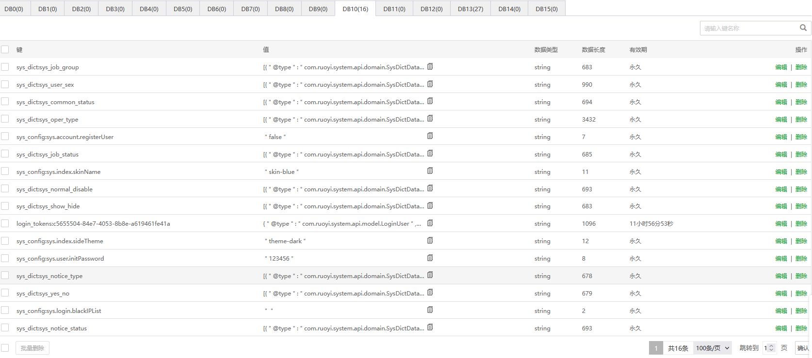
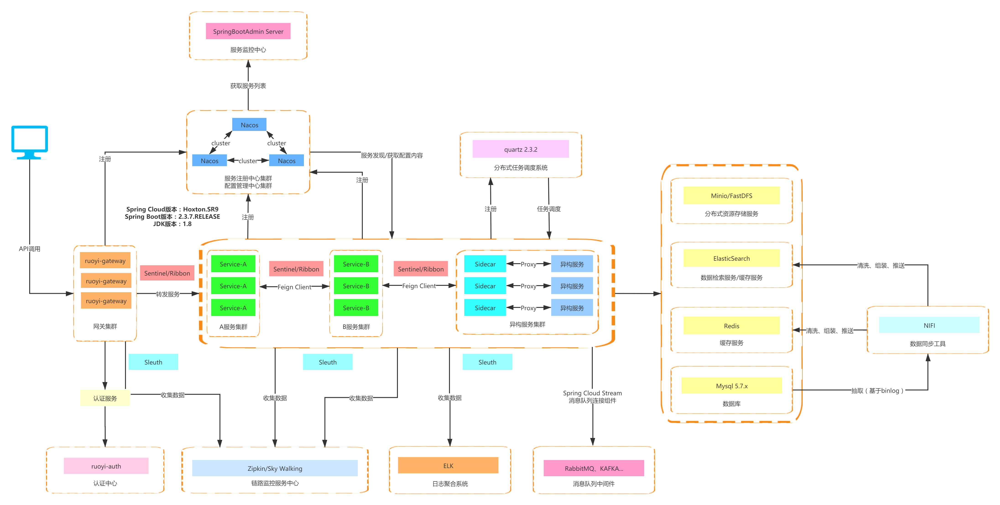
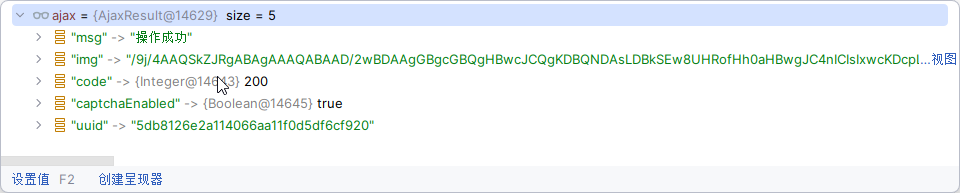
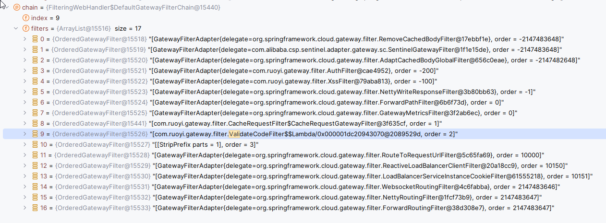
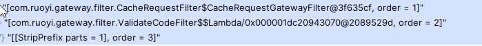

# 〇、前置知识：

若依-Vue版已经看过我的全套视频：https://www.bilibili.com/video/BV1zm4y1A7yQ/?spm_id_from=333.999.0.0


# 一、运行所需环境

```bash
# 官方推荐的环境
JDK >= 1.8 (推荐1.8版本)
Mysql >= 5.7.0 (推荐5.7版本)
Redis >= 3.0
Maven >= 3.0
Node >= 12
nacos >= 2.0.4 (ruoyi-cloud < 3.0 需要下载nacos >= 1.4.x版本)
sentinel >= 1.6.0


# 本人实际的环境
JDK 21   本地JDK和云端JDK均为JDK21
MySQL 5.7    云端数据库
Redis  云端Redis 7.2
Maven  用的默认IDEA自带的，这个基本上影响不大，无所谓
Node  本地版本是v16.19.1，云端不需要这个  
nacos 仅在云端部署，版本是2.3.2
sentinel 最新版

```


# 二、运行后端

## 1. 数据库建立并导入基础数据

1、前往`Gitee`下载页面([https://gitee.com/y_project/RuoYi-Cloud (opens new window)](https://gitee.com/y_project/RuoYi-Cloud))下载解压到工作目录
2、导入到`IDEA`，直接解压后拖入`RuoYi-Cloud-master`整个文件夹进入`IDEA`即可。`IDEA`会自动加载`Maven`依赖包，初次加载会比较慢（根据自身网络情况而定）
3、创建数据库`ry-cloud`并导入数据脚本`ry_2021xxxx.sql`（必须），quartz.sql（可选）
4、创建数据库`ry-config`并导入数据脚本`ry_config_2021xxxx.sql`（必须）

> 提示
>
> 配置文件`application.properties`是在下载的`nacos-server`包`conf`目录下。
> 最新`RuoYi-Cloud`版本`>=3.0.0`需要下载的`nacos-server`必须`>=2.x.x`版本。
> 默认配置单机模式，`nacos`集群/多集群部署模式参考 ([Nacos支持三种部署模式 (opens new window)](https://nacos.io/zh-cn/docs/deployment.html))

## 2. docker中运行nacos


1. 拉取nacos镜像

```bash
docker pull nacos/nacos-server
```

2. 运行容器

```bash
docker run -d \
--name nacos1 \
-e PREFER_HOST_MODE=hostname \
-e MODE=standalone \
-e SPRING_DATASOURCE_PLATFORM=mysql \
-e MYSQL_SERVICE_HOST=ruoyi-mysql \
-e MYSQL_SERVICE_PORT=3306 \
-e MYSQL_SERVICE_USER=root \
-e MYSQL_SERVICE_PASSWORD=mysql1234 \
-e MYSQL_SERVICE_DB_NAME=ry-config \
-e JVM_XMS=256m \
-e JVM_XMX=256m \
--network=host \
nacos/nacos-server
```


## 3. 打开运行基础模块

启动没有先后顺序

- **RuoYiGatewayApplication （网关模块 必须）**
- **RuoYiAuthApplication （认证模块 必须）**
- **RuoYiSystemApplication （系统模块 必须）**
- RuoYiMonitorApplication （监控中心 可选）
- RuoYiGenApplication （代码生成 可选）
- RuoYiJobApplication （定时任务 可选）
- RuoYFileApplication （文件服务 可选）


### 1）运行网关模块


1. 修改`bootstarp.yml`

```yaml
# Tomcat
server:
  port: 8080

# Spring
spring:
  application:
    # 应用名称
    name: ruoyi-gateway
  profiles:
    # 环境配置
    active: dev
  cloud:
    nacos:
      discovery:
        # 服务注册地址
        server-addr: 154.211.15.157:8848
      config:
        # 配置中心地址
        server-addr: 154.211.15.157:8848
        # 配置文件格式
        file-extension: yml
        # 共享配置
        shared-configs:
          - application-${spring.profiles.active}.${spring.cloud.nacos.config.file-extension}
    sentinel:
      # 取消控制台懒加载
      eager: true
      transport:
        # 控制台地址
        dashboard: 127.0.0.1:8718
      # nacos配置持久化
      datasource:
        ds1:
          nacos:
            server-addr: 154.211.15.157:8848
            dataId: sentinel-ruoyi-gateway
            groupId: DEFAULT_GROUP
            data-type: json
            rule-type: gw-flow

```

2. 修改`ruoyi-gateway-dev.yml`，修改了Redis配置

```yaml
spring:
  redis:
    host: 154.211.15.157
    port: 6379
    password: dfasf15asfasd56fas51
    database: 10
  cloud:
    gateway:
      discovery:
        locator:
          lowerCaseServiceId: true
          enabled: true
      routes:
        # 认证中心
        - id: ruoyi-auth
          uri: lb://ruoyi-auth
          predicates:
            - Path=/auth/**
          filters:
            # 验证码处理
            - CacheRequestFilter
            - ValidateCodeFilter
            - StripPrefix=1
        # 代码生成
        - id: ruoyi-gen
          uri: lb://ruoyi-gen
          predicates:
            - Path=/code/**
          filters:
            - StripPrefix=1
        # 定时任务
        - id: ruoyi-job
          uri: lb://ruoyi-job
          predicates:
            - Path=/schedule/**
          filters:
            - StripPrefix=1
        # 系统模块
        - id: ruoyi-system
          uri: lb://ruoyi-system
          predicates:
            - Path=/system/**
          filters:
            - StripPrefix=1
        # 文件服务
        - id: ruoyi-file
          uri: lb://ruoyi-file
          predicates:
            - Path=/file/**
          filters:
            - StripPrefix=1

# 安全配置
security:
  # 验证码
  captcha:
    enabled: true
    type: math
  # 防止XSS攻击
  xss:
    enabled: true
    excludeUrls:
      - /system/notice
  # 不校验白名单
  ignore:
    whites:
      - /auth/logout
      - /auth/login
      - /auth/register
      - /*/v2/api-docs
      - /csrf

```


> 遇到的坑（不是所有人都会遇到，我运气不好，遇到了）：parse data from Nacos error
>
> https://zhuanlan.zhihu.com/p/530018807


3. 运行后端

直接运行`RuoYiGatewayApplication`类的`main`方法即可

4. 启动后，分析控制台

```text
20:38:36.190 [main] INFO  c.a.n.c.e.SearchableProperties - [sortPropertySourceDefaultOrder,197] - properties search order:PROPERTIES->JVM->ENV->DEFAULT_SETTING
20:38:36.260 [background-preinit] INFO  o.h.v.i.util.Version - [<clinit>,21] - HV000001: Hibernate Validator 6.2.5.Final
20:38:36.749 [main] INFO  c.a.n.p.a.s.c.ClientAuthPluginManager - [init,56] - [ClientAuthPluginManager] Load ClientAuthService com.alibaba.nacos.client.auth.impl.NacosClientAuthServiceImpl success.
20:38:36.750 [main] INFO  c.a.n.p.a.s.c.ClientAuthPluginManager - [init,56] - [ClientAuthPluginManager] Load ClientAuthService com.alibaba.nacos.client.auth.ram.RamClientAuthServiceImpl success.
Spring Boot Version: 2.7.18
Spring Application Name: ruoyi-gateway
                            _                        _                                 
                           (_)                      | |                                
 _ __  _   _   ___   _   _  _  ______   __ _   __ _ | |_   ___ __      __  __ _  _   _ 
| '__|| | | | / _ \ | | | || ||______| / _` | / _` || __| / _ \\ \ /\ / / / _` || | | |
| |   | |_| || (_) || |_| || |        | (_| || (_| || |_ |  __/ \ V  V / | (_| || |_| |
|_|    \__,_| \___/  \__, ||_|         \__, | \__,_| \__| \___|  \_/\_/   \__,_| \__, |
                      __/ |             __/ |                                     __/ |
                     |___/             |___/                                     |___/ 
20:38:38.234 [main] WARN  c.a.c.n.c.NacosPropertySourceBuilder - [loadNacosData,87] - Ignore the empty nacos configuration and get it based on dataId[ruoyi-gateway] & group[DEFAULT_GROUP]
20:38:38.714 [main] WARN  c.a.c.n.c.NacosPropertySourceBuilder - [loadNacosData,87] - Ignore the empty nacos configuration and get it based on dataId[ruoyi-gateway.yml] & group[DEFAULT_GROUP]
20:38:38.906 [main] INFO  c.r.g.RuoYiGatewayApplication - [logStartupProfileInfo,638] - The following 1 profile is active: "dev"
20:38:42.262 [main] INFO  c.a.c.s.g.s.SentinelSCGAutoConfiguration - [sentinelGatewayFilter,144] - [Sentinel SpringCloudGateway] register SentinelGatewayFilter with order: -2147483648
20:38:42.843 [main] INFO  c.a.c.s.g.s.SentinelSCGAutoConfiguration - [sentinelGatewayBlockExceptionHandler,134] - [Sentinel SpringCloudGateway] register SentinelGatewayBlockExceptionHandler
INFO: Sentinel log output type is: file
INFO: Sentinel log charset is: utf-8
INFO: Sentinel log base directory is: C:\Users\WQJ\logs\csp\
INFO: Sentinel log name use pid is: false
INFO: Sentinel log level is: INFO
20:38:43.252 [main] WARN  o.s.c.l.c.LoadBalancerCacheAutoConfiguration$LoadBalancerCaffeineWarnLogger - [logWarning,83] - Spring Cloud LoadBalancer is currently working with the default cache. While this cache implementation is useful for development and tests, it's recommended to use Caffeine cache in production.You can switch to using Caffeine cache, by adding it and org.springframework.cache.caffeine.CaffeineCacheManager to the classpath.
20:38:43.311 [main] INFO  c.a.n.p.a.s.c.ClientAuthPluginManager - [init,56] - [ClientAuthPluginManager] Load ClientAuthService com.alibaba.nacos.client.auth.impl.NacosClientAuthServiceImpl success.
20:38:43.311 [main] INFO  c.a.n.p.a.s.c.ClientAuthPluginManager - [init,56] - [ClientAuthPluginManager] Load ClientAuthService com.alibaba.nacos.client.auth.ram.RamClientAuthServiceImpl success.
20:38:44.011 [main] INFO  c.a.n.p.a.s.c.ClientAuthPluginManager - [init,56] - [ClientAuthPluginManager] Load ClientAuthService com.alibaba.nacos.client.auth.impl.NacosClientAuthServiceImpl success.
20:38:44.011 [main] INFO  c.a.n.p.a.s.c.ClientAuthPluginManager - [init,56] - [ClientAuthPluginManager] Load ClientAuthService com.alibaba.nacos.client.auth.ram.RamClientAuthServiceImpl success.
20:38:44.477 [main] INFO  c.a.c.n.r.NacosServiceRegistry - [register,76] - nacos registry, DEFAULT_GROUP ruoyi-gateway 172.27.118.99:8080 register finished
20:38:44.760 [main] INFO  c.a.c.n.d.GatewayLocatorHeartBeatPublisher - [start,64] - Start nacos gateway locator heartBeat task scheduler.
20:38:44.785 [main] INFO  c.r.g.RuoYiGatewayApplication - [logStarted,61] - Started RuoYiGatewayApplication in 9.113 seconds (JVM running for 10.241)
20:38:44.788 [main] INFO  c.a.c.n.r.NacosContextRefresher - [registerNacosListener,129] - [Nacos Config] Listening config: dataId=ruoyi-gateway, group=DEFAULT_GROUP
20:38:44.788 [main] INFO  c.a.c.n.r.NacosContextRefresher - [registerNacosListener,129] - [Nacos Config] Listening config: dataId=ruoyi-gateway.yml, group=DEFAULT_GROUP
20:38:44.790 [main] INFO  c.a.c.n.r.NacosContextRefresher - [registerNacosListener,129] - [Nacos Config] Listening config: dataId=ruoyi-gateway-dev.yml, group=DEFAULT_GROUP
(♥◠‿◠)ﾉﾞ  若依网关启动成功   ლ(´ڡ`ლ)ﾞ  
 .-------.       ____     __        
 |  _ _   \      \   \   /  /    
 | ( ' )  |       \  _. /  '       
 |(_ o _) /        _( )_ .'         
 | (_,_).' __  ___(_ o _)'          
 |  |\ \  |  ||   |(_,_)'         
 |  | \ `'   /|   `-'  /           
 |  |  \    /  \      /           
 ''-'   `'-'    `-..-'       
```


### 2）运行认证模块

1. 修改`bootstarp`信息如下：

```yaml
# Tomcat
server:
  port: 9200

# Spring
spring:
  application:
    # 应用名称
    name: ruoyi-auth
  profiles:
    # 环境配置
    active: dev
  cloud:
    nacos:
      discovery:
        # 服务注册地址
        server-addr: 154.211.15.157:8848
      config:
        # 配置中心地址
        server-addr: 154.211.15.157:8848
        # 配置文件格式
        file-extension: yml
        # 共享配置
        shared-configs:
          - application-${spring.profiles.active}.${spring.cloud.nacos.config.file-extension}

```


2. `ruoyi-auth-dev.yml`的信息修改：

```yaml
spring:
  redis:
    host: 154.211.15.157
    port: 6379
    password: dfasf15asfasd56fas51
    database: 10
```

3. 运行 `RuoYiAuthApplication `

   直接`RuoYiAuthApplication`类的`main`方法

4. 控制台信息

```
22:23:11.292 [main] INFO  c.a.n.c.e.SearchableProperties - [sortPropertySourceDefaultOrder,197] - properties search order:PROPERTIES->JVM->ENV->DEFAULT_SETTING
22:23:11.368 [background-preinit] INFO  o.h.v.i.util.Version - [<clinit>,21] - HV000001: Hibernate Validator 6.2.5.Final
22:23:11.781 [main] INFO  c.a.n.p.a.s.c.ClientAuthPluginManager - [init,56] - [ClientAuthPluginManager] Load ClientAuthService com.alibaba.nacos.client.auth.impl.NacosClientAuthServiceImpl success.
22:23:11.782 [main] INFO  c.a.n.p.a.s.c.ClientAuthPluginManager - [init,56] - [ClientAuthPluginManager] Load ClientAuthService com.alibaba.nacos.client.auth.ram.RamClientAuthServiceImpl success.
Spring Boot Version: 2.7.18
Spring Application Name: ruoyi-auth
                            _                        _    _     
                           (_)                      | |  | |    
 _ __  _   _   ___   _   _  _  ______   __ _  _   _ | |_ | |__  
| '__|| | | | / _ \ | | | || ||______| / _` || | | || __|| '_ \ 
| |   | |_| || (_) || |_| || |        | (_| || |_| || |_ | | | |
|_|    \__,_| \___/  \__, ||_|         \__,_| \__,_| \__||_| |_|
                      __/ |                                     
                     |___/                                      
22:23:13.275 [main] WARN  c.a.c.n.c.NacosPropertySourceBuilder - [loadNacosData,87] - Ignore the empty nacos configuration and get it based on dataId[ruoyi-auth] & group[DEFAULT_GROUP]
22:23:13.360 [main] WARN  c.a.c.n.c.NacosPropertySourceBuilder - [loadNacosData,87] - Ignore the empty nacos configuration and get it based on dataId[ruoyi-auth.yml] & group[DEFAULT_GROUP]
22:23:13.474 [main] INFO  c.r.a.RuoYiAuthApplication - [logStartupProfileInfo,638] - The following 1 profile is active: "dev"
22:23:15.458 [main] INFO  o.a.c.h.Http11NioProtocol - [log,173] - Initializing ProtocolHandler ["http-nio-9200"]
22:23:15.460 [main] INFO  o.a.c.c.StandardService - [log,173] - Starting service [Tomcat]
22:23:15.460 [main] INFO  o.a.c.c.StandardEngine - [log,173] - Starting Servlet engine: [Apache Tomcat/9.0.83]
22:23:15.609 [main] INFO  o.a.c.c.C.[.[.[/] - [log,173] - Initializing Spring embedded WebApplicationContext
22:23:16.962 [main] INFO  c.a.c.s.SentinelWebMvcConfigurer - [addInterceptors,52] - [Sentinel Starter] register SentinelWebInterceptor with urlPatterns: [/**].
22:23:17.645 [main] WARN  o.s.c.l.c.LoadBalancerCacheAutoConfiguration$LoadBalancerCaffeineWarnLogger - [logWarning,83] - Spring Cloud LoadBalancer is currently working with the default cache. While this cache implementation is useful for development and tests, it's recommended to use Caffeine cache in production.You can switch to using Caffeine cache, by adding it and org.springframework.cache.caffeine.CaffeineCacheManager to the classpath.
22:23:17.744 [main] INFO  o.a.c.h.Http11NioProtocol - [log,173] - Starting ProtocolHandler ["http-nio-9200"]
22:23:17.773 [main] INFO  c.a.n.p.a.s.c.ClientAuthPluginManager - [init,56] - [ClientAuthPluginManager] Load ClientAuthService com.alibaba.nacos.client.auth.impl.NacosClientAuthServiceImpl success.
22:23:17.774 [main] INFO  c.a.n.p.a.s.c.ClientAuthPluginManager - [init,56] - [ClientAuthPluginManager] Load ClientAuthService com.alibaba.nacos.client.auth.ram.RamClientAuthServiceImpl success.
22:23:18.581 [main] INFO  c.a.c.n.r.NacosServiceRegistry - [register,76] - nacos registry, DEFAULT_GROUP ruoyi-auth 172.27.118.99:9200 register finished
22:23:18.620 [main] INFO  c.r.a.RuoYiAuthApplication - [logStarted,61] - Started RuoYiAuthApplication in 7.845 seconds (JVM running for 8.87)
22:23:18.640 [main] INFO  c.a.c.n.r.NacosContextRefresher - [registerNacosListener,129] - [Nacos Config] Listening config: dataId=ruoyi-auth.yml, group=DEFAULT_GROUP
22:23:18.642 [main] INFO  c.a.c.n.r.NacosContextRefresher - [registerNacosListener,129] - [Nacos Config] Listening config: dataId=ruoyi-auth-dev.yml, group=DEFAULT_GROUP
22:23:18.643 [main] INFO  c.a.c.n.r.NacosContextRefresher - [registerNacosListener,129] - [Nacos Config] Listening config: dataId=ruoyi-auth, group=DEFAULT_GROUP
(♥◠‿◠)ﾉﾞ  认证授权中心启动成功   ლ(´ڡ`ლ)ﾞ  
 .-------.       ____     __        
 |  _ _   \      \   \   /  /    
 | ( ' )  |       \  _. /  '       
 |(_ o _) /        _( )_ .'         
 | (_,_).' __  ___(_ o _)'          
 |  |\ \  |  ||   |(_,_)'         
 |  | \ `'   /|   `-'  /           
 |  |  \    /  \      /           
 ''-'   `'-'    `-..-'              
22:23:18.854 [RMI TCP Connection(2)-192.168.137.1] INFO  o.a.c.c.C.[.[.[/] - [log,173] - Initializing Spring DispatcherServlet 'dispatcherServlet'
INFO: Sentinel log output type is: file
INFO: Sentinel log charset is: utf-8
INFO: Sentinel log base directory is: C:\Users\WQJ\logs\csp\
INFO: Sentinel log name use pid is: false
INFO: Sentinel log level is: INFO

```


### 3）运行系统模块

RuoYiSystemApplication 

1. `bootstarp.yml`

```yaml
# Tomcat
server:
  port: 9201

# Spring
spring:
  application:
    # 应用名称
    name: ruoyi-system
  profiles:
    # 环境配置
    active: dev
  cloud:
    nacos:
      discovery:
        # 服务注册地址
        server-addr: 154.211.15.157:8848
      config:
        # 配置中心地址
        server-addr: 154.211.15.157:8848
        # 配置文件格式
        file-extension: yml
        # 共享配置
        shared-configs:
          - application-${spring.profiles.active}.${spring.cloud.nacos.config.file-extension}

```

2.  `ruoyi-system-dev.yml`

```yaml
# spring配置
spring:
  redis:
    host: 154.211.15.157
    port: 6379
    password: dfasf15asfasd56fas51
    database: 10
  datasource:
    druid:
      stat-view-servlet:
        enabled: true
        loginUsername: admin
        loginPassword: 123456
    dynamic:
      druid:
        initial-size: 5
        min-idle: 5
        maxActive: 20
        maxWait: 60000
        connectTimeout: 30000
        socketTimeout: 60000
        timeBetweenEvictionRunsMillis: 60000
        minEvictableIdleTimeMillis: 300000
        validationQuery: SELECT 1 FROM DUAL
        testWhileIdle: true
        testOnBorrow: false
        testOnReturn: false
        poolPreparedStatements: true
        maxPoolPreparedStatementPerConnectionSize: 20
        filters: stat,slf4j
        connectionProperties: druid.stat.mergeSql\=true;druid.stat.slowSqlMillis\=5000
      datasource:
          # 主库数据源
          master:
            driver-class-name: com.mysql.cj.jdbc.Driver
            url: jdbc:mysql://154.211.15.157:3306/ry-cloud1?useUnicode=true&characterEncoding=utf8&zeroDateTimeBehavior=convertToNull&useSSL=true&serverTimezone=GMT%2B8
            username: ry-cloud1
            password: 4x7N5x3msrjNNtwF
          # 从库数据源
          # slave:
            # username: 
            # password: 
            # url: 
            # driver-class-name: 

# mybatis配置
mybatis:
    # 搜索指定包别名
    typeAliasesPackage: com.ruoyi.system
    # 配置mapper的扫描，找到所有的mapper.xml映射文件
    mapperLocations: classpath:mapper/**/*.xml

# swagger配置
swagger:
  title: 系统模块接口文档
  license: Powered By ruoyi
  licenseUrl: https://ruoyi.vip
```


3. 运行 `RuoYiSystemApplication  `

   直接`RuoYiSystemApplication `类的`main`方法

4. 控制台信息

```
22:36:21.321 [main] INFO  c.a.n.c.e.SearchableProperties - [sortPropertySourceDefaultOrder,197] - properties search order:PROPERTIES->JVM->ENV->DEFAULT_SETTING
22:36:21.411 [background-preinit] INFO  o.h.v.i.util.Version - [<clinit>,21] - HV000001: Hibernate Validator 6.2.5.Final
22:36:21.864 [main] INFO  c.a.n.p.a.s.c.ClientAuthPluginManager - [init,56] - [ClientAuthPluginManager] Load ClientAuthService com.alibaba.nacos.client.auth.impl.NacosClientAuthServiceImpl success.
22:36:21.864 [main] INFO  c.a.n.p.a.s.c.ClientAuthPluginManager - [init,56] - [ClientAuthPluginManager] Load ClientAuthService com.alibaba.nacos.client.auth.ram.RamClientAuthServiceImpl success.
Spring Boot Version: 2.7.18
Spring Application Name: ruoyi-system
                            _                           _                    
                           (_)                         | |                   
 _ __  _   _   ___   _   _  _  ______  ___  _   _  ___ | |_   ___  _ __ ___  
| '__|| | | | / _ \ | | | || ||______|/ __|| | | |/ __|| __| / _ \| '_ ` _ \ 
| |   | |_| || (_) || |_| || |        \__ \| |_| |\__ \| |_ |  __/| | | | | |
|_|    \__,_| \___/  \__, ||_|        |___/ \__, ||___/ \__| \___||_| |_| |_|
                      __/ |                  __/ |                           
                     |___/                  |___/                            
22:36:24.890 [main] WARN  c.a.c.n.c.NacosPropertySourceBuilder - [loadNacosData,87] - Ignore the empty nacos configuration and get it based on dataId[ruoyi-system] & group[DEFAULT_GROUP]
22:36:25.008 [main] WARN  c.a.c.n.c.NacosPropertySourceBuilder - [loadNacosData,87] - Ignore the empty nacos configuration and get it based on dataId[ruoyi-system.yml] & group[DEFAULT_GROUP]
22:36:25.146 [main] INFO  c.r.s.RuoYiSystemApplication - [logStartupProfileInfo,638] - The following 1 profile is active: "dev"
22:36:28.106 [main] INFO  o.a.c.h.Http11NioProtocol - [log,173] - Initializing ProtocolHandler ["http-nio-9201"]
22:36:28.108 [main] INFO  o.a.c.c.StandardService - [log,173] - Starting service [Tomcat]
22:36:28.109 [main] INFO  o.a.c.c.StandardEngine - [log,173] - Starting Servlet engine: [Apache Tomcat/9.0.83]
22:36:28.294 [main] INFO  o.a.c.c.C.[.[.[/] - [log,173] - Initializing Spring embedded WebApplicationContext
22:36:35.940 [main] INFO  c.a.d.p.DruidDataSource - [init,1009] - {dataSource-1,master} inited
22:36:35.942 [main] INFO  c.b.d.d.DynamicRoutingDataSource - [addDataSource,160] - dynamic-datasource - add a datasource named [master] success
22:36:35.943 [main] INFO  c.b.d.d.DynamicRoutingDataSource - [afterPropertiesSet,243] - dynamic-datasource initial loaded [1] datasource,primary datasource named [master]
22:36:40.530 [main] INFO  c.a.c.s.SentinelWebMvcConfigurer - [addInterceptors,52] - [Sentinel Starter] register SentinelWebInterceptor with urlPatterns: [/**].
22:36:42.228 [main] WARN  o.s.c.l.c.LoadBalancerCacheAutoConfiguration$LoadBalancerCaffeineWarnLogger - [logWarning,83] - Spring Cloud LoadBalancer is currently working with the default cache. While this cache implementation is useful for development and tests, it's recommended to use Caffeine cache in production.You can switch to using Caffeine cache, by adding it and org.springframework.cache.caffeine.CaffeineCacheManager to the classpath.
22:36:42.327 [main] INFO  o.a.c.h.Http11NioProtocol - [log,173] - Starting ProtocolHandler ["http-nio-9201"]
22:36:42.357 [main] INFO  c.a.n.p.a.s.c.ClientAuthPluginManager - [init,56] - [ClientAuthPluginManager] Load ClientAuthService com.alibaba.nacos.client.auth.impl.NacosClientAuthServiceImpl success.
22:36:42.358 [main] INFO  c.a.n.p.a.s.c.ClientAuthPluginManager - [init,56] - [ClientAuthPluginManager] Load ClientAuthService com.alibaba.nacos.client.auth.ram.RamClientAuthServiceImpl success.
22:36:43.013 [main] INFO  c.a.c.n.r.NacosServiceRegistry - [register,76] - nacos registry, DEFAULT_GROUP ruoyi-system 172.27.118.99:9201 register finished
22:36:43.696 [main] INFO  c.r.s.RuoYiSystemApplication - [logStarted,61] - Started RuoYiSystemApplication in 23.023 seconds (JVM running for 24.299)
22:36:43.712 [main] INFO  c.a.c.n.r.NacosContextRefresher - [registerNacosListener,129] - [Nacos Config] Listening config: dataId=ruoyi-system, group=DEFAULT_GROUP
22:36:43.712 [main] INFO  c.a.c.n.r.NacosContextRefresher - [registerNacosListener,129] - [Nacos Config] Listening config: dataId=ruoyi-system.yml, group=DEFAULT_GROUP
22:36:43.714 [main] INFO  c.a.c.n.r.NacosContextRefresher - [registerNacosListener,129] - [Nacos Config] Listening config: dataId=ruoyi-system-dev.yml, group=DEFAULT_GROUP
(♥◠‿◠)ﾉﾞ  系统模块启动成功   ლ(´ڡ`ლ)ﾞ  
 .-------.       ____     __        
 |  _ _   \      \   \   /  /    
 | ( ' )  |       \  _. /  '       
 |(_ o _) /        _( )_ .'         
 | (_,_).' __  ___(_ o _)'          
 |  |\ \  |  ||   |(_,_)'         
 |  | \ `'   /|   `-'  /           
 |  |  \    /  \      /           
 ''-'   `'-'    `-..-'              
22:36:44.166 [RMI TCP Connection(2)-192.168.137.1] INFO  o.a.c.c.C.[.[.[/] - [log,173] - Initializing Spring DispatcherServlet 'dispatcherServlet'
INFO: Sentinel log output type is: file
INFO: Sentinel log charset is: utf-8
INFO: Sentinel log base directory is: C:\Users\WQJ\logs\csp\
INFO: Sentinel log name use pid is: false
INFO: Sentinel log level is: INFO
```


## 4. 其他暂不运行模块的yml

这里列出来全部的yml，哪怕是没改的都列出来了，因为怕有人询问为啥某个模块的yml少了。


### 1）application-dev.yml

这个application-dev.yml是共享的配置，全部的服务都可以用，没改它的配置数据

### 2）ruoyi-monitor-dev.yml

没改

### 3）ruoyi-gen-dev.yml

```yaml
# spring配置
spring:
  redis:
    host: 154.211.15.157
    port: 6379
    password: dfasf15asfasd56fas51
    database: 10
  datasource:
    driver-class-name: com.mysql.cj.jdbc.Driver
    url: jdbc:mysql://154.211.15.157:3306/ry-cloud?useUnicode=true&characterEncoding=utf8&zeroDateTimeBehavior=convertToNull&useSSL=true&serverTimezone=GMT%2B8
    username: ry-cloud
    password: TCnFyHkBrKtisTZ7


# mybatis配置
mybatis:
    # 搜索指定包别名
    typeAliasesPackage: com.ruoyi.gen.domain
    # 配置mapper的扫描，找到所有的mapper.xml映射文件
    mapperLocations: classpath:mapper/**/*.xml

# swagger配置
swagger:
  title: 代码生成接口文档
  license: Powered By ruoyi
  licenseUrl: https://ruoyi.vip

# 代码生成
gen:
  # 作者
  author: ruoyi
  # 默认生成包路径 system 需改成自己的模块名称 如 system monitor tool
  packageName: com.ruoyi.system
  # 自动去除表前缀，默认是false
  autoRemovePre: false
  # 表前缀（生成类名不会包含表前缀，多个用逗号分隔）
  tablePrefix: sys_

```

### 4) ruoyi-job-dev.yml

```yaml
# spring配置
spring:
  redis:
    host: 154.211.15.157
    port: 6379
    password: dfasf15asfasd56fas51
    database: 10
  datasource:
    driver-class-name: com.mysql.cj.jdbc.Driver
    url: jdbc:mysql://154.211.15.157:3306/ry-cloud?useUnicode=true&characterEncoding=utf8&zeroDateTimeBehavior=convertToNull&useSSL=true&serverTimezone=GMT%2B8
    username: ry-cloud
    password: TCnFyHkBrKtisTZ7

# mybatis配置
mybatis:
    # 搜索指定包别名
    typeAliasesPackage: com.ruoyi.job.domain
    # 配置mapper的扫描，找到所有的mapper.xml映射文件
    mapperLocations: classpath:mapper/**/*.xml

# swagger配置
swagger:
  title: 定时任务接口文档
  license: Powered By ruoyi
  licenseUrl: https://ruoyi.vip

```

### 5）ruoyi-file-dev.yml

没改

### 6）sentinel-ruoyi-gateway

没改


# 三、运行前端

## 1. 安装依赖

下面两个安装依赖的

```bash
pnpm i

npm i
```


## 2. 运行命令

```bash
pnpm run dev
```


## 3. 运行后Redis数据




# 四、项目介绍

### 后端结构

```text
com.ruoyi     
├── ruoyi-ui              // 前端框架 [80]
├── ruoyi-gateway         // 网关模块 [8080]
├── ruoyi-auth            // 认证中心 [9200]
├── ruoyi-api             // 接口模块
│       └── ruoyi-api-system                          // 系统接口
├── ruoyi-common          // 通用模块
│       └── ruoyi-common-core                         // 核心模块
│       └── ruoyi-common-datascope                    // 权限范围
│       └── ruoyi-common-datasource                   // 多数据源
│       └── ruoyi-common-log                          // 日志记录
│       └── ruoyi-common-redis                        // 缓存服务
│       └── ruoyi-common-seata                        // 分布式事务
│       └── ruoyi-common-security                     // 安全模块
│       └── ruoyi-common-swagger                      // 系统接口
├── ruoyi-modules         // 业务模块
│       └── ruoyi-system                              // 系统模块 [9201]
│       └── ruoyi-gen                                 // 代码生成 [9202]
│       └── ruoyi-job                                 // 定时任务 [9203]
│       └── ruoyi-file                                // 文件服务 [9300]
├── ruoyi-visual          // 图形化管理模块
│       └── ruoyi-visual-monitor                      // 监控中心 [9100]
├──pom.xml                // 公共依赖
```

### 前端结构

```text
├── build                      // 构建相关  
├── bin                        // 执行脚本
├── public                     // 公共文件
│   ├── favicon.ico            // favicon图标
│   └── index.html             // html模板
├── src                        // 源代码
│   ├── api                    // 所有请求
│   ├── assets                 // 主题 字体等静态资源
│   ├── components             // 全局公用组件
│   ├── directive              // 全局指令
│   ├── layout                 // 布局
│   ├── plugins                // 通用方法
│   ├── router                 // 路由
│   ├── store                  // 全局 store管理
│   ├── utils                  // 全局公用方法
│   ├── views                  // view
│   ├── App.vue                // 入口页面
│   ├── main.js                // 入口 加载组件 初始化等
│   ├── permission.js          // 权限管理
│   └── settings.js            // 系统配置
├── .editorconfig              // 编码格式
├── .env.development           // 开发环境配置
├── .env.production            // 生产环境配置
├── .env.staging               // 测试环境配置
├── .eslintignore              // 忽略语法检查
├── .eslintrc.js               // eslint 配置项
├── .gitignore                 // git 忽略项
├── babel.config.js            // babel.config.js
├── package.json               // package.json
└── vue.config.js              // vue.config.js
```


# 五、服务网关


### 1. 微服务架构图：

 http://doc.ruoyi.vip/ruoyi-cloud/




架构图可以看出

> 前端通过API调用的是网关，网关地址是http://localhost:8080，然后网关通过路由分发，把流量打入其他微服务中。

### 2. 路由分发具体分发策略是：

```yaml
spring:
  cloud:
    gateway:
      discovery:
        locator:
          lowerCaseServiceId: true
          enabled: true
      routes:
        # 认证中心
        - id: ruoyi-auth
          uri: lb://ruoyi-auth
          predicates:
            - Path=/auth/**
          filters:
            # 验证码处理
            - CacheRequestFilter
            - ValidateCodeFilter
            - StripPrefix=1
        # 代码生成
        - id: ruoyi-gen
          uri: lb://ruoyi-gen
          predicates:
            - Path=/code/**
          filters:
            - StripPrefix=1
        # 定时任务
        - id: ruoyi-job
          uri: lb://ruoyi-job
          predicates:
            - Path=/schedule/**
          filters:
            - StripPrefix=1
        # 系统模块
        - id: ruoyi-system
          uri: lb://ruoyi-system
          predicates:
            - Path=/system/**
          filters:
            - StripPrefix=1
        # 文件服务
        - id: ruoyi-file
          uri: lb://ruoyi-file
          predicates:
            - Path=/file/**
          filters:
            - StripPrefix=1

```

### 3. yml文件的含义：

 YAML 配置文件主要是用于配置 Spring Boot 应用程序的一些属性和 Spring Cloud Gateway 的路由规则。下面是对文件中内容的解释：

1. Redis 配置：
   - `host: 154.211.15.157`：Redis 服务器的主机地址。
   - `port: 6379`：Redis 服务器的端口。
   - `password: dfasf15asfasd56fas51`：Redis 服务器的密码。
   - `database: 10`：Redis 数据库的编号。

2. Spring Cloud Gateway 配置：
   - `discovery.locator.lowerCaseServiceId: true`：表示将服务名转换为小写。
   - `discovery.locator.enabled: true`：启用服务发现。
   - `routes`：定义 Spring Cloud Gateway 的路由规则。
     - `id: ruoyi-auth`：路由规则的 ID，用于唯一标识该路由规则。
     - `uri: lb://ruoyi-auth`：路由的目标地址，使用负载均衡的方式访问 `ruoyi-auth` 服务。
     - `predicates`：定义路由规则的匹配条件。
       - `- Path=/auth/**`：请求路径匹配规则，表示所有以 `/auth/` 开头的请求。
     - `filters`：定义过滤器，对请求进行过滤和处理。
       - `- CacheRequestFilter`：缓存请求的过滤器。
       - `- ValidateCodeFilter`：验证码验证过滤器。
       - `- StripPrefix=1`：移除请求路径中的/auth前缀。

3. 安全配置：
   - `security.captcha.enabled: true`：启用验证码功能。
   - `security.captcha.type: math`：验证码类型为数学运算题。
   - `security.xss.enabled: true`：启用防止 XSS 攻击功能。
   - `security.xss.excludeUrls`：配置不进行 XSS 过滤的请求路径白名单。

这个 YAML 文件主要是对 Redis 配置、Spring Cloud Gateway 路由规则和应用程序的安全配置进行了详细的定义和说明。

### 4. 过滤器：

SpringCloud默认的源码中过滤器的名称如下

1. **AddRequestHeaderGatewayFilterFactory**
   
   - **作用**：向请求添加指定的请求头。
   - **使用场景**：用于在网关层面为请求添加必要的标识或元数据，如认证信息、跟踪标识等。
   - **示例**：假设需要在请求中添加一个自定义的认证头信息。
     ```yaml
     - AddRequestHeader=Authorization,Bearer abc123
     ```
   
2. **AddRequestParameterGatewayFilterFactory**
   
   - **作用**：向请求添加指定的请求参数。
   - **使用场景**：可用于在网关层面向请求添加额外的参数，适用于特定的请求处理或路由转发。
   - **示例**：假设需要在请求中添加一个额外的查询参数。
     ```yaml
     - AddRequestParameter=category,news
     ```
   
3. **AddResponseHeaderGatewayFilterFactory**
   - **作用**：向响应添加指定的响应头。
   - **使用场景**：用于在网关层面为响应添加额外的头信息，如安全相关的头信息或自定义的响应头。
   - **示例**：假设需要在响应中添加一个自定义的头信息。
     ```yaml
     - AddResponseHeader=X-Custom-Header,custom-value
     ```

4. **CacheRequestBodyGatewayFilterFactory**
   - **作用**：缓存请求体，用于支持重复读取请求体的场景。
   - **使用场景**：适用于需要多次读取请求体的情况，如请求体验证、处理或后续路由的需要。
   - **示例**：假设需要缓存请求体以便后续使用。
     ```yaml
     - CacheRequestBody=10KB
     ```

5. **DedupeResponseHeaderGatewayFilterFactory**
   - **作用**：去重响应中的指定响应头。
   - **使用场景**：可用于去除响应中重复的头信息，确保响应头的唯一性和规范性。
   - **示例**：假设响应中可能包含重复的头信息，需要去重。
     ```yaml
     - DedupeResponseHeader=X-Custom-Header
     ```

6. **FallbackHeadersGatewayFilterFactory**
   - **作用**：设置在网关转发失败时的备用响应头。
   - **使用场景**：当网关无法正常转发请求时，返回指定的备用响应头信息，用于故障处理或降级处理。
   - **示例**：假设在网关转发失败时返回一个备用的响应头信息。
     ```yaml
     - FallbackHeaders=X-Error-Message,Fallback
     ```

7. **JsonToGrpcGatewayFilterFactory**
   - **作用**：将 JSON 请求转换为 gRPC 请求。
   - **使用场景**：适用于将 JSON 格式的请求转换为 gRPC 协议格式的请求，用于 gRPC 服务的调用和处理。
   - **示例**：假设需要将 JSON 请求转换为 gRPC 请求。
     ```yaml
     - JsonToGrpc
     ```

8. **MapRequestHeaderGatewayFilterFactory**
   - **作用**：映射请求头的值。
   - **使用场景**：用于在网关层面根据指定规则映射请求头的值，例如将某个请求头的值映射为其他请求头的值。
   - **示例**：假设需要将请求头中的一个值映射为另一个请求头的值。
     ```yaml
     - MapRequestHeader=Source-Header:Dest-Header
     ```

9. **PrefixPathGatewayFilterFactory**
   - **作用**：添加前缀到请求路径。
   - **使用场景**：用于在网关层面对请求路径添加前缀，用于路由转发或路径重写。
   - **示例**：假设需要在请求路径前添加一个前缀。
     ```yaml
     - PrefixPath=/prefix
     ```

10. **PreserveHostHeaderGatewayFilterFactory**
    - **作用**：保留原始请求的 Host 头。
    - **使用场景**：用于在进行请求转发时保留原始请求的 Host 头，确保后端服务能够正确处理请求。
    - **示例**：假设需要在进行请求转发时保留原始请求的 Host 头。
      ```yaml
      - PreserveHostHeader
      ```

11. **RedirectToGatewayFilterFactory**
    - **作用**：将请求重定向到指定的 URL。
    - **使用场景**：可用于将请求重定向到其他服务或地址，用于请求的重定向处理。
    - **示例**：假设需要将请求重定向到另一个地址。
      ```yaml
      - RedirectTo=https://example.com/redirected
      ```

12. **RemoveRequestHeaderGatewayFilterFactory**
    - **作用**：移除指定的请求头。
    - **使用场景**：可用于在网关层面移除请求中的特定请求头，用于安全性或简化请求处理。
    - **示例**：假设需要移除请求中的某个请求头。
      ```yaml
      - RemoveRequestHeader=Authorization
      ```

13. **RemoveRequestParameterGatewayFilterFactory**
    - **作用**：移除指定的请求参数。
    - **使用场景**：适用于在网关层面移除请求中的特定请求参数，用于简化请求或保护隐私。
    - **示例**：假设需要移除请求中的某个请求参数。
      ```yaml
      - RemoveRequestParameter=debug
      ```

14. **RemoveResponseHeaderGatewayFilterFactory**
    - **作用**：移除指定的响应头。
    
    - **使用场景**：可用于在网关层面移除响应中的特定响应头，用于简化响应或安全性处理。
    
    - **示例**：假设需要移除响应中的某个响应头。
    
    - ```yaml
      - RemoveResponseHeader=X-Custom-Header
      ```

15. **RequestHeaderSizeGatewayFilterFactory**
    - **作用**：限制请求头的大小。
    - **使用场景**：用于限制客户端请求中的请求头大小，防止过大的请求头导致的问题。
    - **示例**：假设需要限制请求头的大小为1KB。
      ```yaml
      - RequestHeaderSize=1KB
      ```

16. **RequestHeaderToRequestUriGatewayFilterFactory**
    - **作用**：将请求头的值设置为请求 URI。
    - **使用场景**：适用于将请求头的值设置到请求 URI 中，用于特定的请求处理或路由转发。
    - **示例**：假设需要将请求头中的一个值设置为请求的 URI。
      ```yaml
      - RequestHeaderToRequestUri=X-Forwarded-Prefix
      ```

17. **RequestRateLimiterGatewayFilterFactory**
    - **作用**：基于请求速率进行限流。
    - **使用场景**：用于限制请求的速率，防止过多的请求导致系统负载过大或服务不可用。
    - **示例**：假设需要对请求进行基于速率的限流，每秒允许10个请求。
      ```yaml
      - RequestRateLimiter=10,1s
      ```

18. **RequestSizeGatewayFilterFactory**
    - **作用**：限制请求体的大小。
    - **使用场景**：用于限制客户端请求中的请求体大小，防止过大的请求体导致的问题。
    - **示例**：假设需要限制请求体的大小为1MB。
      ```yaml
      - RequestSize=1MB
      ```

19. **RetryGatewayFilterFactory**
    - **作用**：对请求进行重试。
    - **使用场景**：适用于对请求进行重试处理，当请求失败时自动重试一定次数。
    - **示例**：假设需要对请求进行3次重试。
      ```yaml
      - Retry=3
      ```

20. **RewriteLocationResponseHeaderGatewayFilterFactory**
    - **作用**：重写响应中的 Location 头。
    - **使用场景**：可用于在网关层面重写响应中的 Location 头信息，如重定向处理。
    - **示例**：假设需要将响应中的 Location 头重写为另一个地址。
      ```yaml
      - RewriteLocationResponseHeader=Location,https://example.com/new-location
      ```

21. **RewritePathGatewayFilterFactory**
    - **作用**：重写请求的路径。
    - **使用场景**：用于在网关层面重写请求的路径信息，可根据规则将原始路径重写为目标路径。
    - **示例**：假设需要将请求的路径重写为另一个路径。
      ```yaml
      - RewritePath=/old-path,/new-path
      ```

22. **RewriteResponseHeaderGatewayFilterFactory**
    - **作用**：重写响应中的指定响应头。
    - **使用场景**：用于在网关层面重写响应中的特定响应头信息，如安全性处理或响应头重写。
    - **示例**：假设需要将响应中的某个响应头重写为另一个值。
      ```yaml
      - RewriteResponseHeader=X-Custom-Header,new-value
      ```

23. **SaveSessionGatewayFilterFactory**
    - **作用**：保存会话信息。
    - **使用场景**：可用于在网关层面保存会话状态，适用于需要跨请求保持状态的场景。
    - **示例**：假设需要保存会话信息。
      ```yaml
      - SaveSession
      ```

24. **SecureHeadersGatewayFilterFactory**
    - **作用**：添加安全相关的响应头。
    - **使用场景**：用于在响应中添加安全相关的响应头信息，如防止跨站点请求伪造（CSRF）等。
    - **示例**：假设需要在响应中添加安全相关的响应头信息。
      ```yaml
      - SecureHeaders
      ```

25. **SetPathGatewayFilterFactory**
    - **作用**：设置请求的路径。
    - **使用场景**：用于在网关层面设置请求的路径信息，可修改请求的路径。
    - **示例**：假设需要设置请求的路径为另一个路径。
      ```yaml
      - SetPath=/new-path
      ```

26. **SetRequestHeaderGatewayFilterFactory**
    - **作用**：设置请求头的值。
    - **使用场景**：用于在网关层面设置请求头的值，如添加特定的请求头信息。
    - **示例**：假设需要设置请求头的值为一个固定值。
      ```yaml
      - SetRequestHeader=Custom-Header,custom-value
      ```

27. **SetRequestHostHeaderGatewayFilterFactory**
    - **作用**：设置请求的 Host 头。
    - **使用场景**：用于在网关层面设置请求的 Host 头信息，可修改 Host 头。
    - **示例**：假设需要设置请求的 Host 头为指定的值。
      ```yaml
      - SetRequestHostHeader=example.com
      ```

28. **SetResponseHeaderGatewayFilterFactory**
    - **作用**：设置响应头的值。
    - **使用场景**：用于在网关层面设置响应头的值，如添加特定的响应头信息。
    - **示例**：假设需要设置响应头的值为一个固定值。
      ```yaml
      - SetResponseHeader=Custom-Header,custom-value
      ```

29. **SetStatusGatewayFilterFactory**
    - **作用**：设置响应的 HTTP 状态码。
    
    - **使用场景**：用于在网关层面设置响应的 HTTP 状态码，可修改响应的状态码。
    
    - **示例**：假设需要设置响应的 HTTP 状态码为404。
    
    - ```yaml
      - SetStatus=404	
      ```

30. **StripPrefixGatewayFilterFactory**
    
    - **作用**：移除请求路径中的前缀。
    - **使用场景**：用于在网关层面移除请求路径中的指定前缀，用于路由转发或路径处理。
    - **示例**：假设需要移除请求路径中的一个前缀。
      
      ```yaml
      - StripPrefix=1 
      ```
    
31. **TokenRelayGatewayFilterFactory**
    
    - **作用**：传递令牌（Token）。
    - **使用场景**：用于在网关层面传递请求中的令牌信息，如 OAuth2 的令牌。
    - **示例**：假设需要传递请求中的 OAuth2 令牌。
      ```yaml
      - TokenRelay
      ```
    
32. **ModifyRequestBodyGatewayFilterFactory**
    - **作用**：修改请求体的内容。
    - **使用场景**：用于在网关层面修改请求体的内容，如修改 JSON 请求体。
    - **示例**：假设需要将 JSON 请求体中的某个字段修改为另一个值。
      ```yaml
      - ModifyRequestBody=application/json,Object.path,new-value
      ```

33. **ModifyResponseBodyGatewayFilterFactory**
    
    - **作用**：修改响应体的内容。
    - **使用场景**：用于在网关层面修改响应体的内容，如修改 JSON 响应体。
    - **示例**：假设需要将 JSON 响应体中的某个字段修改为另一个值。
      ```yaml
      - ModifyResponseBody=application/json,Object.path,new-value
      ```


### 5. 断言

下面是源码中每个断言工厂的作用、使用场景和一个示例：

1. **AfterRoutePredicateFactory.java**
   
   - **作用**：匹配请求时间在指定时间之后的路由规则。
   - **使用场景**：适用于需要根据请求时间进行后置匹配的场景。
   - **示例**：假设需要匹配请求时间在指定时间之后的路由规则。
     
     ```yaml
     - After=2023-01-01T00:00:00
     ```
   
2. **BeforeRoutePredicateFactory.java**
   - **作用**：匹配请求时间在指定时间之前的路由规则。
   - **使用场景**：适用于需要根据请求时间进行前置匹配的场景。
   - **示例**：假设需要匹配请求时间在指定时间之前的路由规则。
     ```yaml
     - Before=2023-12-31T23:59:59
     ```

3. **BetweenRoutePredicateFactory.java**
   - **作用**：匹配请求时间在指定时间区间内的路由规则。
   - **使用场景**：适用于需要根据请求时间进行区间匹配的场景。
   - **示例**：假设需要匹配请求时间在指定时间区间内的路由规则。
     ```yaml
     - Between=2023-01-01T00:00:00,2023-12-31T23:59:59
     ```

4. **CloudFoundryRouteServiceRoutePredicateFactory.java**
   - **作用**：匹配 Cloud Foundry 路由服务的请求。
   - **使用场景**：适用于在 Cloud Foundry 环境中匹配请求的场景。
   - **示例**：假设需要匹配 Cloud Foundry 路由服务的请求。
     ```yaml
     - CloudFoundryRouteService
     ```

5. **CookieRoutePredicateFactory.java**
   - **作用**：匹配请求中特定 Cookie 值的路由规则。
   - **使用场景**：适用于根据请求中的 Cookie 值进行匹配的场景。
   - **示例**：假设需要匹配请求中特定 Cookie 值的路由规则。
     ```yaml
     - Cookie=name,value
     ```

6. **HeaderRoutePredicateFactory.java**
   - **作用**：匹配请求头信息的路由规则。
   - **使用场景**：适用于根据请求头信息进行匹配的场景。
   - **示例**：假设需要匹配请求头中特定的头信息。
     ```yaml
     - Header=Content-Type,application/json
     ```

7. **HostRoutePredicateFactory.java**
   - **作用**：匹配请求主机名的路由规则。
   - **使用场景**：适用于根据请求的主机名进行匹配的场景。
   - **示例**：假设需要匹配请求的主机名。
     ```yaml
     - Host=example.com
     ```

8. **MethodRoutePredicateFactory.java**
   - **作用**：匹配请求方法的路由规则。
   - **使用场景**：适用于根据请求方法进行匹配的场景。
   - **示例**：假设需要匹配请求方法为 GET 的路由规则。
     ```yaml
     - Method=GET
     ```

9. **PathRoutePredicateFactory.java**
   - **作用**：匹配请求路径的路由规则。
   - **使用场景**：适用于根据请求路径进行匹配的场景。
   - **示例**：假设需要匹配请求路径为 /api 的路由规则。
     ```yaml
     - Path=/api/**
     ```

10. **QueryRoutePredicateFactory.java**
    - **作用**：匹配请求查询参数的路由规则。
    - **使用场景**：适用于根据请求查询参数进行匹配的场景。
    - **示例**：假设需要匹配请求中带有特定查询参数的路由规则。
      ```yaml
      - Query=param=value
      ```

11. **ReadBodyRoutePredicateFactory.java**
    - **作用**：匹配请求体内容的路由规则。
    - **使用场景**：适用于根据请求体内容进行匹配的场景。
    - **示例**：假设需要匹配请求体中包含特定内容的路由规则。
      ```yaml
      - ReadBody='{"key":"value"}'
      ```

12. **RemoteAddrRoutePredicateFactory.java**
    - **作用**：匹配请求的远程地址的路由规则。
    - **使用场景**：适用于根据请求的远程地址进行匹配的场景。
    - **示例**：假设需要匹配请求的远程地址为特定地址的路由规则。
      ```yaml
      - RemoteAddr=192.168.1.100
      ```

13. **WeightRoutePredicateFactory.java**
    - **作用**：按权重配置路由规则。
    - **使用场景**：适用于按照权重配置路由规则的场景。
    - **示例**：假设需要按照权重配置路由规则，权重为 10。
      ```yaml
      - Weight=10
      ```

14. **XForwardedRemoteAddrRoutePredicateFactory.java**
    - **作用**：匹配 X-Forwarded-For 头部的请求的路由规则。


 - **使用场景**：适用于根据 X-Forwarded-For 头部进行匹配的场景。
    - **示例**：假设需要匹配 X-Forwarded-For 头部为特定地址的请求的路由规则。
      ```yaml
      - XForwardedRemoteAddr=192.168.1.100
      ```

这些断言工厂类提供了丰富的条件匹配功能，可以根据请求的不同属性或条件灵活地配置路由规则，满足各种不同场景下的路由需求。


### 6. 自定义局部过滤器

实现`GatewayFilterFactory`接口的类

```
BlackListUrlFilter：黑名单过滤
CacheRequestFilter：获取body请求数据（解决流不能重复读取问题）
ValidateCodeFilter：验证码判断正确与否
```

### 7. 全局过滤器

```
AuthFilter：鉴权过滤器
BlackListUrlFilter：黑名单URL过滤器
```


# 六、基础知识插叙

## 1. spring.factories作用

`spring.factories` 文件是 Spring Boot 的一个特殊配置文件，用于自动配置和加载 Spring Boot 应用程序的各种组件。这个文件通常位于项目的 `src/main/resources/META-INF` 目录下，用于声明各种自动配置类或者 Spring Bean 的加载。

具体来说，`spring.factories` 文件的作用包括：

1. **自动配置加载**：Spring Boot 在启动时会自动扫描并加载 `spring.factories` 文件中声明的自动配置类，这些自动配置类会根据条件自动配置应用程序的各种组件，如数据源、缓存、安全等。
2. **Spring Bean 注册**：除了自动配置类外，`spring.factories` 文件也可以用于声明其他 Spring Bean 的加载。通过在文件中配置需要注册的 Bean 类路径，Spring Boot 在启动时会自动注册这些 Bean。
3. **条件化加载**：`spring.factories` 文件中声明的自动配置类或 Spring Bean 可以通过条件化加载来满足特定的条件才进行加载和配置，这样可以根据不同的环境或配置进行灵活的自动配置。

总的来说，`spring.factories` 文件是 Spring Boot 的一个重要机制，通过它可以实现自动化配置和加载，减少开发者的配置工作，提高应用程序的开发效率和灵活性。

然而 SpringBoot 3 移除了该配置文件，

取而代之的是`/META-INF/spring/org.springframework.boot.autoconfigure.AutoConfiguration.imports`文件


# 七、验证码的获取

请求路径：http://localhost/dev-api/code ，发送的Get请求。

前端的devServer会将请求拿过来转发给 `http://localhost:8080/code`，该地址即网关的地址

而后，网关看到后发现自己有一个路由配置类信息：

```java
package com.ruoyi.gateway.config;

import org.springframework.beans.factory.annotation.Autowired;
import org.springframework.context.annotation.Bean;
import org.springframework.context.annotation.Configuration;
import org.springframework.http.MediaType;
import org.springframework.web.reactive.function.server.RequestPredicates;
import org.springframework.web.reactive.function.server.RouterFunction;
import org.springframework.web.reactive.function.server.RouterFunctions;
import com.ruoyi.gateway.handler.ValidateCodeHandler;

/**
 * 路由配置信息
 *
 * @author ruoyi
 */
@Configuration
public class RouterFunctionConfiguration
{
    @Autowired
    private ValidateCodeHandler validateCodeHandler;

    @SuppressWarnings("rawtypes")
    @Bean
    public RouterFunction routerFunction()
    {
        return RouterFunctions.route(
                RequestPredicates.GET("/code").and(RequestPredicates.accept(MediaType.TEXT_PLAIN)),
                validateCodeHandler
        );
    }
}
```

该配置将路径为`/code`的`get`请求交给`ValidateCodeHandler`处理，程序将执行`handle`方法处理该请求：

```java
    @Override
    public Mono<ServerResponse> handle(ServerRequest serverRequest)
    {
        AjaxResult ajax;
        try
        {
            ajax = validateCodeService.createCaptcha();
        }
        catch (CaptchaException | IOException e)
        {
            return Mono.error(e);
        }
        return ServerResponse.status(HttpStatus.OK).body(BodyInserters.fromValue(ajax));
    }

```

下面debug查看生成验证码的过程，生成验证码的返回结果为：



而后前端拿到验证码，直接展示。方法如下：

```javascript
    getCode() {
      getCodeImg().then(res => {
        this.captchaEnabled = res.captchaEnabled === undefined ? true : res.captchaEnabled;
        if (this.captchaEnabled) {
          this.codeUrl = "data:image/gif;base64," + res.img;
          this.loginForm.uuid = res.uuid;
        }
      });
    },
```

```
data:image/gif;base64,/9j/4AAQSkZJRgABAgAAAQABAAD/2wBDAAgGBgcGBQgHBwcJCQgKDBQNDAsLDBkSEw8UHRofHh0aHBwgJC4nICIsIxwcKDcpLDAxNDQ0Hyc5PTgyPC4zNDL/2wBDAQkJCQwLDBgNDRgyIRwhMjIyMjIyMjIyMjIyMjIyMjIyMjIyMjIyMjIyMjIyMjIyMjIyMjIyMjIyMjIyMjIyMjL/wAARCAA8AKADASIAAhEBAxEB/8QAHwAAAQUBAQEBAQEAAAAAAAAAAAECAwQFBgcICQoL/8QAtRAAAgEDAwIEAwUFBAQAAAF9AQIDAAQRBRIhMUEGE1FhByJxFDKBkaEII0KxwRVS0fAkM2JyggkKFhcYGRolJicoKSo0NTY3ODk6Q0RFRkdISUpTVFVWV1hZWmNkZWZnaGlqc3R1dnd4eXqDhIWGh4iJipKTlJWWl5iZmqKjpKWmp6ipqrKztLW2t7i5usLDxMXGx8jJytLT1NXW19jZ2uHi4+Tl5ufo6erx8vP09fb3+Pn6/8QAHwEAAwEBAQEBAQEBAQAAAAAAAAECAwQFBgcICQoL/8QAtREAAgECBAQDBAcFBAQAAQJ3AAECAxEEBSExBhJBUQdhcRMiMoEIFEKRobHBCSMzUvAVYnLRChYkNOEl8RcYGRomJygpKjU2Nzg5OkNERUZHSElKU1RVVldYWVpjZGVmZ2hpanN0dXZ3eHl6goOEhYaHiImKkpOUlZaXmJmaoqOkpaanqKmqsrO0tba3uLm6wsPExcbHyMnK0tPU1dbX2Nna4uPk5ebn6Onq8vP09fb3+Pn6/9oADAMBAAIRAxEAPwDtrW1ga1hZoIySikkoOeKsCztv+feL/vgU2z/484P+ua/yqyKiMY8q0IjGPKtCIWdr/wA+0P8A3wKeLK1/59of+/YqUU4U+WPYfLHsRCytP+fWH/v2KcLG0/59YP8Av2Kbd3tvYWstzdSrFDEpZ3boBWd4e8Vad4mS4fT/ADjHA4QtIm0MTzxzn88VosPKUHUUfdW7toFo3sawsLP/AJ9YP+/YpwsLP/n0g/79ipdwAyTxVXTtYsNUacWNwk6wNsd05Xd6A9D+FSqd02log5Y9iwNPsv8An0t/+/Y/wpw06y/587f/AL9L/hU4pi3Vu10bYTIZwu8xhhuC9MkelLkXYOWPYQadY/8APnb/APfpf8KcNNsf+fK3/wC/S/4VYFOFLlj2Dlj2K40yw/58rb/v0v8AhTxplh/z423/AH6X/CrAp24DrRyx7Byx7FcaXp//AD423/flf8KeNK0//nwtf+/K/wCFYNx8QPDNpqi6dJqsJnLbTs+ZVPoWHH+HeuojdXUFSCD0IrWphp00nOFr7XW4JRexXGlad/z4Wv8A35X/AApw0nTv+gfa/wDflf8ACrQp4rLlj2Dlj2Ko0nTf+gfaf9+V/wAKranpenx6Reuljaq6wOVYQqCDtPI4rWFVdW/5At//ANe8n/oJpSjHlegpRjyvQ5Kz/wCPOD/rmv8AKrIqvZ/8ecH/AFzX+VWRTj8KHH4UOFKeBQKSThDVFHmnxW1aRNMg06Jjm4k+YDuB2/PFY3wn1UW17eae5w0m2VQe+OD/ADFRfE5z/a9gzH5V3fzFcbDqR0/WIdRsWKyRvvwRgH1H0I/nX3GX4V4nKlhYxfvqUubopKWifqkc05Wqc3Y+gPFVy48M6gsZIdrdwPyrmfhNdIPDZhUjcs7bv0rQg1i28Q6BHd25yki4dCeUPdTXHeBrv+wfFl3o0zbY5juiJ4BPb8x/KvCw1OUsFiMM1acWpW9Lp/dc1b95M9D8c+Im0Pw5cSwtid12Rn0J715h8LddNn4tmS5lZmvoiu9zklwcjJ+ma2/irM0mnwgH5Q/PNeZlzbra3cEvl3CEEbeoIPDV7GT4ajUy10pL3qrcb9mldX8rozqNqd+x9RXet2OmRwSX1wsEUz+Wsr8IGxkAntnB5PHH0qDVvF2iaJZm5vdQgVcZVUYMz/7oHJrz2z8W6V4w8OvpV8wS4lj2yQng7h/EhPXkZHfjmuFutK0LQLk/bJ5byReVtwu3Ppn2/GvHw2WU/aOjiedVE/hUbuS8nsvV3XU0c3a62PVvD/xZ07X9fGmJZTWySBvJmlcZYjnBUdOM9zXGfEHxT4gvNfl0WGSS3s2YIuxceYD3z6VjW/jWWExtNoVuLBWBQIm0p6FWxjI9sV3Wm3Fn4otzc2M+8KcOjDDIfQj/ACK7KtN5bW+srD+7a2slJKXe62fk/kyU+dWueea3oelaZouY2kN2CP3jN989+PTrXq3wl8Vvq+h/YLqQtc2WEyTyyfwn+n5V5z8QtLuIJLZo0ZolyGCjOD6mtf4T2nk3hvI3zuGxh/Q1viKscRkvtcRU5puV15dLeSaRKVqlktD35eRTxUMBzGDU4r5E6Bwqrq3/ACBL/wD69pP/AEE1bFVdX/5Al/8A9e0n/oJqZfCyZfCzkrP/AI8oP+ua/wAqsiq9l/x5Qf8AXNf5VZFEfhQR+FDhSSLlCKcKdjIqijzfxjoC6mAJIydrblI6iuFufDIQYMBVfVete9zWUc33lFZ95oUMsRAQZrpp4zEUko05tJaqzYnFPdHz1H9p0nVI4Bey20RkVjImcYz94rnnFdZ4k027uJrXUNPQvdRMDmPgkdQf8+tdJe+D4Zr5Hlt1k2H5dwyK6O30HMS/LjA9K9avns6k6NeMffimpaK0r6dNdVv+BmqVk10OU1FD4k8Oo00TJIy4dGUho3H1riofC7wHdMplI7YwK92g0dWj2stD+G4Cp+Qc+1edTzHEUYSpUJOMZO9l/nv/AJ9S3BPVnzjqNk2n3gYb0jJ3Ky9V/wDrivRrTRV1mys7q6SC5nVPlmQHDDscH+XY10GqeD0klIMSsh6qRkGui8M6DBp1mlvHFsjXOFyTjPPeuzGZxUxWHpxndThdX7prvv69GTGmot9jlI9CnRTuTcpGCCMgitHw14VstM1Zr+0Wa3d1KyRI37twfVT+fGK9BFjEVxtFOisI42yBXkwrVIRcYyaT3Xf1LaTOM8R6CLyMkg4I7cVwOi+IP+EK8TfYNYtw8ErLtvEG07CcBmHQ46Hvwete53VqJISMVwuseGbXUphHe2cc8anjcOR9CORXTgq9GnJxxEeaDXTddmn+mz6ikm9j0W1dXiVkIKkZBHerIrH0OBbWwhto1KxRIERck4AGAOa2RXG/IocKq6v/AMgS/wD+vaT/ANBNWxVXV/8AkCX/AP17Sf8AoJqJfCyZfCzkrL/jyt/+ua/yqyK5mLWrmKJI1SIhFCjIPb8ak/t+6/55w/8AfJ/xrKNaNkZxqxsjpRThXM/8JDd/884P++T/AI0v/CRXf/POD/vk/wCNV7aI/bROoFOxkVy3/CSXn/PKD/vk/wCNL/wkt5/zyg/75P8AjR7aIe2idIbVGbJUVOkKqMAVyv8Awk97/wA8rf8A75b/ABpf+Eovf+eVv/3y3+NHtoh7aJ1yoBTwK4//AISq+/55W/8A3y3+NL/wld9/zytv++W/xo9tEPbROta3R+oFSRQqnQVx/wDwlt//AM8bb/vlv8aX/hL9Q/5423/fLf8AxVHtoh7aJ2wFPFcP/wAJhqH/ADxtf++W/wDiqX/hMtR/542v/fLf/FUe2iHtonc4yKia0RzkqK4z/hM9R/542v8A3w3/AMVS/wDCa6l/zwtP++G/+Ko9tEPbRO5iiCDAFTiuA/4TbUv+eFp/3w3/AMVS/wDCcan/AM8LT/vhv/iqPbRD20T0EVV1f/kB6h/17Sf+gmuK/wCE51P/AJ4Wn/fDf/FVHc+M9RurWa3eG1CSoyMVVsgEY4+aplWjZilVjZn/2Q==
```


## 1. 验证码返回json数据的作用

```json
{
    "msg": "操作成功",
    "img": "/9j/4AAQSkZJRgABA.....此处省略x字",
    "code": 200,
    "captchaEnabled": true,
    "uuid": "a095e34e5d74405d8a7b0ba517ccac03"
}
```

`img`：图像的base64编码结果

`uuid`：后端的Redis记录了UUID和验证码的答案，后面调登录接口的时候后通过前端传来的UUID，在Redis中取出来答案，看看你输入的答案和正确答案对不对得上。

`captchaEnabled`给前端，为了让前端根据该值来隐藏验证码的展示区域。

```vue
<el-form-item prop="code" v-if="captchaEnabled">
  <el-input
    v-model="loginForm.code"
    auto-complete="off"
    placeholder="验证码"
    style="width: 63%"
    @keyup.enter.native="handleLogin"
  >
    <svg-icon slot="prefix" icon-class="validCode" class="el-input__icon input-icon" />
  </el-input>
  <div class="login-code">
    
  </div>
</el-form-item>
```


# 八、登录

学习登录前，一定要看过我的曾经讲过的若依-Vue视频，我不再重复讲述JWT的相关内容。


整体而言，前端输入账号密码，前端收集表单，内容为uuid，验证码答案，用户名，密码，将其传入后端进行认证操作。

认证即查询数据库，查询到用户之后，把用户信息放入Redis中，同时生成一个token给前端。

下一次前端需要访问后端API的时候，每次都要拿着token，后端会有拦截器解析token确认时哪一个用户。

## 8.1 全流程

请求路径：http://localhost/dev-api/auth/login

请求方式：POST

前端的devServer会把请求打入http://localhost:8080，同时会把dev-api前缀给干掉。

最后请求后端的URL是http://localhost:8080/auth/login

现在，进入了网关，路径为/auth/**开头的请求被通过注册中心负载均衡打入微服务ruoyi-auth中

根据路由规则，需要走三个过滤器：

```yaml
      routes:
        # 认证中心
        - id: ruoyi-auth
          uri: lb://ruoyi-auth
          predicates:
            - Path=/auth/**
          filters:
            # 验证码处理
            - CacheRequestFilter
            - ValidateCodeFilter
            - StripPrefix=1
```

debug发现整体的过滤器链条：



从图中可以看出过滤器的执行顺序：



```
CacheRequestFilter：获取body请求数据（解决流不能重复读取问题）
ValidateCodeFilter：验证码校验过滤器，用于校验验证码输入对不对。
StripPrefixGatewayFilterFactory：去掉最前面的一级路径前缀，示例： /aaaa/bbbb   =>   /bbbb
```

而后进入其他微服务，其他内容直接debug，不再手动码字。


### 用户查询selectUserByUserName的SQL：

```xml
<sql id="selectUserVo">
       select u.user_id, u.dept_id, u.user_name, u.nick_name, u.email, u.avatar, u.phonenumber, u.password, u.sex, u.status, u.del_flag, u.login_ip, u.login_date, u.create_by, u.create_time, u.remark, 
       d.dept_id, d.parent_id, d.ancestors, d.dept_name, d.order_num, d.leader, d.status as dept_status,
       r.role_id, r.role_name, r.role_key, r.role_sort, r.data_scope, r.status as role_status
       from sys_user u
        left join sys_dept d on u.dept_id = d.dept_id
        left join sys_user_role ur on u.user_id = ur.user_id
        left join sys_role r on r.role_id = ur.role_id
</sql>


<select id="selectUserByUserName" parameterType="String" resultMap="SysUserResult">
    <include refid="selectUserVo"/>
    where u.user_name = #{userName} and u.del_flag = '0'
</select>


select u.user_id, u.dept_id, u.user_name, u.nick_name, u.email, u.avatar, u.phonenumber, u.password, u.sex, u.status, u.del_flag, u.login_ip, u.login_date, u.create_by, u.create_time, u.remark, 
d.dept_id, d.parent_id, d.ancestors, d.dept_name, d.order_num, d.leader, d.status as dept_status,
r.role_id, r.role_name, r.role_key, r.role_sort, r.data_scope, r.status as role_status
from sys_user u
left join sys_dept d on u.dept_id = d.dept_id
left join sys_user_role ur on u.user_id = ur.user_id
left join sys_role r on r.role_id = ur.role_id
where u.user_name = 'admin' and u.del_flag = '0'
```


### association和collection

在 MyBatis 中，`<association>` 和 `<collection>` 是用来描述实体之间关联关系的 XML 元素，用于在查询结果映射中定义实体之间的关系。这些元素通常用于在查询时将多个表的数据映射到一个实体中，或者将一个表的数据映射到多个实体中。

1. **`<association>`：**

   - `<association>` 元素用于描述一对一或多对一的关联关系，即一个实体关联另一个实体的情况。

   - 在 `<association>` 元素中可以定义实体之间的关联属性和映射关系，例如主实体的属性名、关联实体的属性名、关联实体的类型等。

   - 示例：

     ```
     xmlCopy code<resultMap id="userResultMap" type="User">
         <id property="id" column="user_id"/>
         <result property="username" column="username"/>
         <association property="department" javaType="Department">
             <id property="id" column="dept_id"/>
             <result property="name" column="dept_name"/>
         </association>
     </resultMap>
     ```

2. **`<collection>`：**

   - `<collection>` 元素用于描述一对多或多对多的关联关系，即一个实体包含多个子实体的集合。

   - 在 `<collection>` 元素中可以定义实体之间的关联属性和映射关系，例如主实体的属性名、关联实体的集合属性名、关联实体的类型等。

   - 示例：

     ```
     xmlCopy code<resultMap id="departmentResultMap" type="Department">
         <id property="id" column="dept_id"/>
         <result property="name" column="dept_name"/>
         <collection property="employees" ofType="Employee">
             <id property="id" column="emp_id"/>
             <result property="name" column="emp_name"/>
         </collection>
     </resultMap>
     ```

在上面的示例中，`<association>` 和 `<collection>` 元素分别用于描述了一对一和一对多的关联关系。在实际使用时，可以根据实体之间的关系和数据库查询结果的结构来选择合适的关联元素，以便进行数据的映射和关联查询。

在 MyBatis 中，使用这些关联元素可以方便地实现复杂的数据映射和关联查询操作，提高了查询效率和开发效率。


### 登录最后返回token

返回token后，前端把token信息存起来，登录过程结束。

接下来，前端跳转到/index界面。被路由守卫拦截，执行代码：

```js
import router from './router'
import store from './store'
import { Message } from 'element-ui'
import NProgress from 'nprogress'
import 'nprogress/nprogress.css'
import { getToken } from '@/utils/auth'
import { isRelogin } from '@/utils/request'

NProgress.configure({ showSpinner: false })

const whiteList = ['/login', '/register']

router.beforeEach((to, from, next) => {
  NProgress.start()
  if (getToken()) {
    to.meta.title && store.dispatch('settings/setTitle', to.meta.title)
    /* has token*/
    if (to.path === '/login') {
      next({ path: '/' })
      NProgress.done()
    } else if (whiteList.indexOf(to.path) !== -1) {
      next()
    } else {
      if (store.getters.roles.length === 0) {
        isRelogin.show = true
        // 判断当前用户是否已拉取完user_info信息
        store.dispatch('GetInfo').then(() => {
          isRelogin.show = false
          store.dispatch('GenerateRoutes').then(accessRoutes => {
            // 根据roles权限生成可访问的路由表
            router.addRoutes(accessRoutes) // 动态添加可访问路由表
            next({ ...to, replace: true }) // hack方法 确保addRoutes已完成
          })
        }).catch(err => {
            store.dispatch('LogOut').then(() => {
              Message.error(err)
              next({ path: '/' })
            })
          })
      } else {
        next()
      }
    }
  } else {
    // 没有token
    if (whiteList.indexOf(to.path) !== -1) {
      // 在免登录白名单，直接进入
      next()
    } else {
      next(`/login?redirect=${encodeURIComponent(to.fullPath)}`) // 否则全部重定向到登录页
      NProgress.done()
    }
  }
})

router.afterEach(() => {
  NProgress.done()
})
```

代码执行中，调用`GetInfo`获取个人信息存入`vuex`，对应接口地址为`/system/user/getInfo`

```js
GetInfo({ commit, state }) {
  return new Promise((resolve, reject) => {
    getInfo().then(res => {
      const user = res.user
      const avatar = (user.avatar == "" || user.avatar == null) ? require("@/assets/images/profile.jpg") : user.avatar;
      if (res.roles && res.roles.length > 0) { // 验证返回的roles是否是一个非空数组
        commit('SET_ROLES', res.roles)
        commit('SET_PERMISSIONS', res.permissions)
      } else {
        commit('SET_ROLES', ['ROLE_DEFAULT'])
      }
      commit('SET_ID', user.userId)
      commit('SET_NAME', user.userName)
      commit('SET_AVATAR', avatar)
      resolve(res)
    }).catch(error => {
      reject(error)
    })
  })
},
```

调用`GenerateRoutes`生成路由，对应接口为`/system/menu/getRouters`

```js
// 生成路由
GenerateRoutes({ commit }) {
  return new Promise(resolve => {
    // 向后端请求路由数据
    getRouters().then(res => {
      const sdata = JSON.parse(JSON.stringify(res.data))
      const rdata = JSON.parse(JSON.stringify(res.data))
      const sidebarRoutes = filterAsyncRouter(sdata)
      const rewriteRoutes = filterAsyncRouter(rdata, false, true)
      const asyncRoutes = filterDynamicRoutes(dynamicRoutes);
      rewriteRoutes.push({ path: '*', redirect: '/404', hidden: true })
      router.addRoutes(asyncRoutes);
      commit('SET_ROUTES', rewriteRoutes)
      commit('SET_SIDEBAR_ROUTERS', constantRoutes.concat(sidebarRoutes))
      commit('SET_DEFAULT_ROUTES', sidebarRoutes)
      commit('SET_TOPBAR_ROUTES', sidebarRoutes)
      resolve(rewriteRoutes)
    })
  })
}
```


## 8.2 BCryptPasswordEncoder

`BCryptPasswordEncoder` 是 Spring Security 提供的密码编码器之一，用于对密码进行哈希加密和验证。BCrypt 是一种密码哈希算法，它采用了适合于密码存储的加盐哈希算法，具有很高的安全性和防抵赖性。

下面是关于 `BCryptPasswordEncoder` 的一些重要信息：

1. **密码哈希算法**：BCrypt 是基于 Blowfish 密码算法的一种哈希算法，它使用了适合于密码存储的加盐哈希方式进行密码加密，每次生成的哈希值都是不同的。

2. **加盐机制**：BCryptPasswordEncoder 会自动为密码生成一个随机的盐值，然后将盐值和密码一起进行哈希计算，生成最终的哈希密码。这种加盐机制可以防止密码被彩虹表破解。

3. **哈希强度**：BCryptPasswordEncoder 支持设置哈希强度，即计算哈希值的次数。强度越高，计算哈希值的次数越多，安全性也越高，默认的哈希强度是 10。

4. **使用示例**：在 Spring Security 中，可以通过 `BCryptPasswordEncoder` 对密码进行加密和验证。示例代码如下所示：

   ```java
   javaCopy code// 创建 BCryptPasswordEncoder 对象
   BCryptPasswordEncoder encoder = new BCryptPasswordEncoder();
   
   // 对密码进行加密
   String encodedPassword = encoder.encode("myPassword");
   
   // 输出加密后的密码
   System.out.println("Encoded Password: " + encodedPassword);
   
   // 验证密码
   boolean match = encoder.matches("myPassword", encodedPassword);
   System.out.println("Password Matched: " + match);
   ```

   在这个示例中，首先创建了一个 `BCryptPasswordEncoder` 对象，然后使用 `encode` 方法对密码进行加密，最后使用 `matches` 方法验证密码是否匹配。

总的来说，`BCryptPasswordEncoder` 是 Spring Security 中用于密码加密和验证的常用工具类，它通过 BCrypt 算法和加盐机制提供了高安全性的密码处理方式。


## 8.3 参考文献

> ## 推荐阅读
>
> SpringBoot自动配置系列
>
> https://www.ynthm.com/posts/spring/spring-boot/spring-boot-config/
>
> 内容：
>
> org.springframework.boot.autoconfigure.EnableAutoConfiguration 下的 spring.factories 移动到名为 META-INF/spring/org.springframework.boot.autoconfigure.AutoConfiguration.imports 的文件中。
>
> 每行包含一个自动配置类的完全限定名称，而不是一个逗号分隔的列表。


## 8.4 可能的疑问

### 1）特殊文件的作用：

/META-INF/spring/org.springframework.boot.autoconfigure.AutoConfiguration.imports

自行参考：https://blog.csdn.net/zhangjunli/article/details/131053305

目的是把org.springframework.boot.autoconfigure.AutoConfiguration.imports全部的类注入到Spring容器。

此处可演示


### 2）切入点表达式

AspectJ 的切点表达式非常灵活，可以精确地定义在哪些连接点上执行通知。以下是一些常用的切点表达式：

1. **匹配方法执行：**
   - `execution(modifiers-pattern? ret-type-pattern declaring-type-pattern?name-pattern(param-pattern)throws-pattern?)`：匹配方法执行。例如：`execution(* com.example.service.*.*(..))` 匹配 `com.example.service` 包下所有类的所有方法。

2. **匹配方法参数：**
   - `args(type-name, ...)`：匹配具有指定参数类型的方法。例如：`args(String, ..)` 匹配第一个参数为 String 类型的方法。
   - `@args(annotation-type)`：匹配带有指定注解的方法参数。

3. **匹配方法注解：**
   - `@annotation(annotation-type)`：匹配带有指定注解的方法。
   - `@within(annotation-type)`：匹配带有指定注解的类及其子类中的所有方法。

4. **匹配类执行：**
   - `within(type-pattern)`：匹配指定类型内的所有方法。例如：`within(com.example.service.*)` 匹配 `com.example.service` 包下所有类的所有方法。
   - `@within(annotation-type)`：匹配带有指定注解的类及其子类中的所有方法。

5. **匹配对象执行：**
   - `this(type)`：匹配当前正在执行的对象实例类型为指定类型的方法。
   - `target(type)`：匹配目标对象类型为指定类型的方法。

6. **匹配方法调用：**
   - `call(modifiers-pattern? ret-type-pattern declaring-type-pattern?name-pattern(param-pattern)throws-pattern?)`：匹配方法调用。

7. **逻辑操作符：**
   - `&&`：逻辑与操作符，用于组合多个条件。
   - `||`：逻辑或操作符，用于组合多个条件。
   - `!`：逻辑非操作符，用于取反条件。

8. **其他常用表达式：**
   - `bean(id-or-name)`：匹配指定名称的 Spring Bean。
   - `this(bean-id-or-name)`：匹配当前对象所属的 Spring Bean。
   - `@within(org.springframework.stereotype.Service)`：匹配标注了 `@Service` 注解的类及其子类中的所有方法。
   - `@target(org.springframework.stereotype.Repository)`：匹配目标对象是标注了 `@Repository` 注解的方法。
   - `@args(org.springframework.validation.annotation.Validated)`：匹配带有 `@Validated` 注解的方法参数。

## 8.5 远程调用时添加负载

如何添加请求头、请求参数、请求体

参考文献：

https://blog.csdn.net/hkk666123/article/details/113964715

https://www.cnblogs.com/daimenglaoshi/p/16886960.html

```java
package com.ruoyi.system.api;


/**
 * 用户服务
 * 
 * @author ruoyi
 */
@FeignClient(contextId = "remoteUserService", value = ServiceNameConstants.SYSTEM_SERVICE, fallbackFactory = RemoteUserFallbackFactory.class)
public interface RemoteUserService
{
    /**
     * 通过用户名查询用户信息
     *
     * @param username 用户名
     * @param source 请求来源
     * @return 结果
     */
    @GetMapping("/user/info/{username}")
    public R<LoginUser> getUserInfo(@PathVariable("username") String username, @RequestHeader(SecurityConstants.FROM_SOURCE) String source);

    /**
     * 注册用户信息
     *
     * @param sysUser 用户信息
     * @param source 请求来源
     * @return 结果
     */
    @PostMapping("/user/register")
    public R<Boolean> registerUserInfo(@RequestBody SysUser sysUser, @RequestHeader(SecurityConstants.FROM_SOURCE) String source);
}
```


# 九、全局异常处理器

和ruoyi-vue一样，微服务版本的全局异常处理器放在包com.ruoyi.common.security.handler下，该包位于`ruoyi-common-security`中，可以说，基本上所有的微服务均需要引入该组件。


下面是该全局异常处理器的实现代码。

```java
package com.ruoyi.common.security.handler;

/**
 * 全局异常处理器
 *
 * @author ruoyi
 */
@RestControllerAdvice
public class GlobalExceptionHandler
{
    private static final Logger log = LoggerFactory.getLogger(GlobalExceptionHandler.class);

    /**
     * 权限码异常
     */
    @ExceptionHandler(NotPermissionException.class)
    public AjaxResult handleNotPermissionException(NotPermissionException e, HttpServletRequest request)
    {
        String requestURI = request.getRequestURI();
        log.error("请求地址'{}',权限码校验失败'{}'", requestURI, e.getMessage());
        return AjaxResult.error(HttpStatus.FORBIDDEN, "没有访问权限，请联系管理员授权");
    }

    /**
     * 角色权限异常
     */
    @ExceptionHandler(NotRoleException.class)
    public AjaxResult handleNotRoleException(NotRoleException e, HttpServletRequest request)
    {
        String requestURI = request.getRequestURI();
        log.error("请求地址'{}',角色权限校验失败'{}'", requestURI, e.getMessage());
        return AjaxResult.error(HttpStatus.FORBIDDEN, "没有访问权限，请联系管理员授权");
    }

    /**
     * 请求方式不支持
     */
    @ExceptionHandler(HttpRequestMethodNotSupportedException.class)
    public AjaxResult handleHttpRequestMethodNotSupported(HttpRequestMethodNotSupportedException e, HttpServletRequest request)
    {
        String requestURI = request.getRequestURI();
        log.error("请求地址'{}',不支持'{}'请求", requestURI, e.getMethod());
        return AjaxResult.error(e.getMessage());
    }

    /**
     * 业务异常
     */
    @ExceptionHandler(ServiceException.class)
    public AjaxResult handleServiceException(ServiceException e, HttpServletRequest request)
    {
        log.error(e.getMessage(), e);
        Integer code = e.getCode();
        return StringUtils.isNotNull(code) ? AjaxResult.error(code, e.getMessage()) : AjaxResult.error(e.getMessage());
    }

    /**
     * 请求路径中缺少必需的路径变量
     */
    @ExceptionHandler(MissingPathVariableException.class)
    public AjaxResult handleMissingPathVariableException(MissingPathVariableException e, HttpServletRequest request)
    {
        String requestURI = request.getRequestURI();
        log.error("请求路径中缺少必需的路径变量'{}',发生系统异常.", requestURI, e);
        return AjaxResult.error(String.format("请求路径中缺少必需的路径变量[%s]", e.getVariableName()));
    }

    /**
     * 请求参数类型不匹配
     */
    @ExceptionHandler(MethodArgumentTypeMismatchException.class)
    public AjaxResult handleMethodArgumentTypeMismatchException(MethodArgumentTypeMismatchException e, HttpServletRequest request)
    {
        String requestURI = request.getRequestURI();
        log.error("请求参数类型不匹配'{}',发生系统异常.", requestURI, e);
        return AjaxResult.error(String.format("请求参数类型不匹配，参数[%s]要求类型为：'%s'，但输入值为：'%s'", e.getName(), e.getRequiredType().getName(), e.getValue()));
    }

    /**
     * 拦截未知的运行时异常
     */
    @ExceptionHandler(RuntimeException.class)
    public AjaxResult handleRuntimeException(RuntimeException e, HttpServletRequest request)
    {
        String requestURI = request.getRequestURI();
        log.error("请求地址'{}',发生未知异常.", requestURI, e);
        return AjaxResult.error(e.getMessage());
    }

    /**
     * 系统异常
     */
    @ExceptionHandler(Exception.class)
    public AjaxResult handleException(Exception e, HttpServletRequest request)
    {
        String requestURI = request.getRequestURI();
        log.error("请求地址'{}',发生系统异常.", requestURI, e);
        return AjaxResult.error(e.getMessage());
    }

    /**
     * 自定义验证异常
     */
    @ExceptionHandler(BindException.class)
    public AjaxResult handleBindException(BindException e)
    {
        log.error(e.getMessage(), e);
        String message = e.getAllErrors().get(0).getDefaultMessage();
        return AjaxResult.error(message);
    }

    /**
     * 自定义验证异常
     */
    @ExceptionHandler(MethodArgumentNotValidException.class)
    public Object handleMethodArgumentNotValidException(MethodArgumentNotValidException e)
    {
        log.error(e.getMessage(), e);
        String message = e.getBindingResult().getFieldError().getDefaultMessage();
        return AjaxResult.error(message);
    }

    /**
     * 内部认证异常
     */
    @ExceptionHandler(InnerAuthException.class)
    public AjaxResult handleInnerAuthException(InnerAuthException e)
    {
        return AjaxResult.error(e.getMessage());
    }

    /**
     * 演示模式异常
     */
    @ExceptionHandler(DemoModeException.class)
    public AjaxResult handleDemoModeException(DemoModeException e)
    {
        return AjaxResult.error("演示模式，不允许操作");
    }
}
```


# 十、Axios封装

`src/utils/request.js`

增加baseUrl

## 10.1 请求拦截器

1. 防止重复提交
3. 根据条件带token


## 10.2 响应拦截器

1. 是否显示重新登录
2. Message
3. MessageBox
4. Notification

## 10.3 通用下载方法

Loading.service，转圈圈。

```js
import axios from 'axios'
import { Notification, MessageBox, Message, Loading } from 'element-ui'
import store from '@/store'
import { getToken } from '@/utils/auth'
import errorCode from '@/utils/errorCode'
import { tansParams, blobValidate } from "@/utils/ruoyi";
import cache from '@/plugins/cache'
import { saveAs } from 'file-saver'

let downloadLoadingInstance;
// 是否显示重新登录
export let isRelogin = { show: false };

axios.defaults.headers['Content-Type'] = 'application/json;charset=utf-8'
// 创建axios实例
const service = axios.create({
  // axios中请求配置有baseURL选项，表示请求URL公共部分
  baseURL: process.env.VUE_APP_BASE_API,
  // 超时
  timeout: 100000000
})

// request拦截器
service.interceptors.request.use(config => {
  // 是否需要设置 token
  const isToken = (config.headers || {}).isToken === false
  // 是否需要防止数据重复提交
  const isRepeatSubmit = (config.headers || {}).repeatSubmit === false
  if (getToken() && !isToken) {
    config.headers['Authorization'] = 'Bearer ' + getToken() // 让每个请求携带自定义token 请根据实际情况自行修改
  }
  // get请求映射params参数
  if (config.method === 'get' && config.params) {
    let url = config.url + '?' + tansParams(config.params);
    url = url.slice(0, -1);
    config.params = {};
    config.url = url;
  }
  if (!isRepeatSubmit && (config.method === 'post' || config.method === 'put')) {
    const requestObj = {
      url: config.url,
      data: typeof config.data === 'object' ? JSON.stringify(config.data) : config.data,
      time: new Date().getTime()
    }
    const requestSize = Object.keys(JSON.stringify(requestObj)).length; // 请求数据大小
    const limitSize = 5 * 1024 * 1024; // 限制存放数据5M
    if (requestSize >= limitSize) {
      console.warn(`[${config.url}]: ` + '请求数据大小超出允许的5M限制，无法进行防重复提交验证。')
      return config;
    }
    const sessionObj = cache.session.getJSON('sessionObj')
    if (sessionObj === undefined || sessionObj === null || sessionObj === '') {
      cache.session.setJSON('sessionObj', requestObj)
    } else {
      const s_url = sessionObj.url;                  // 请求地址
      const s_data = sessionObj.data;                // 请求数据
      const s_time = sessionObj.time;                // 请求时间
      const interval = 1000;                         // 间隔时间(ms)，小于此时间视为重复提交
      if (s_data === requestObj.data && requestObj.time - s_time < interval && s_url === requestObj.url) {
        const message = '数据正在处理，请勿重复提交';
        console.warn(`[${s_url}]: ` + message)
        return Promise.reject(new Error(message))
      } else {
        cache.session.setJSON('sessionObj', requestObj)
      }
    }
  }
  return config
}, error => {
    console.log(error)
    Promise.reject(error)
})

// 响应拦截器
service.interceptors.response.use(res => {
    // 未设置状态码则默认成功状态
    const code = res.data.code || 200;
    // 获取错误信息
    const msg = errorCode[code] || res.data.msg || errorCode['default']
    // 二进制数据则直接返回
    if (res.request.responseType ===  'blob' || res.request.responseType ===  'arraybuffer') {
      return res.data
    }
    if (code === 401) {
      if (!isRelogin.show) {
        isRelogin.show = true;
        MessageBox.confirm('登录状态已过期，您可以继续留在该页面，或者重新登录', '系统提示', { confirmButtonText: '重新登录', cancelButtonText: '取消', type: 'warning' }).then(() => {
          isRelogin.show = false;
          store.dispatch('LogOut').then(() => {
            location.href = '/index';
          })
      }).catch(() => {
        isRelogin.show = false;
      });
    }
      return Promise.reject('无效的会话，或者会话已过期，请重新登录。')
    } else if (code === 500) {
      Message({ message: msg, type: 'error' })
      return Promise.reject(new Error(msg))
    } else if (code === 601) {
      Message({ message: msg, type: 'warning' })
      return Promise.reject('error')
    } else if (code !== 200) {
      Notification.error({ title: msg })
      return Promise.reject('error')
    } else {
      return res.data
    }
  },
  error => {
    console.log('err' + error)
    let { message } = error;
    if (message == "Network Error") {
      message = "后端接口连接异常";
    } else if (message.includes("timeout")) {
      message = "系统接口请求超时";
    } else if (message.includes("Request failed with status code")) {
      message = "系统接口" + message.substr(message.length - 3) + "异常";
    }
    Message({ message: message, type: 'error', duration: 5 * 1000 })
    return Promise.reject(error)
  }
)

// 通用下载方法
export function download(url, params, filename, config) {
  downloadLoadingInstance = Loading.service({ text: "正在下载数据，请稍候", spinner: "el-icon-loading", background: "rgba(0, 0, 0, 0.7)", })
  return service.post(url, params, {
    transformRequest: [(params) => { return tansParams(params) }],
    headers: { 'Content-Type': 'application/x-www-form-urlencoded' },
    responseType: 'blob',
    ...config
  }).then(async (data) => {
    const isBlob = blobValidate(data);
    if (isBlob) {
      const blob = new Blob([data])
      saveAs(blob, filename)
    } else {
      const resText = await data.text();
      const rspObj = JSON.parse(resText);
      const errMsg = errorCode[rspObj.code] || rspObj.msg || errorCode['default']
      Message.error(errMsg);
    }
    downloadLoadingInstance.close();
  }).catch((r) => {
    console.error(r)
    Message.error('下载文件出现错误，请联系管理员！')
    downloadLoadingInstance.close();
  })
}

export default service

```


# 十一、获取个人信息

本节讲述`/user/getInfo`接口，用于获取个人信息。

获取接口前，先经过了authFilter验证token，并把user_id，uuid，user_name存储到了request头信息中。

经过了`HeaderInterceptor`拦截器，而后将user_id，uuid，user_name从请求头取出来，放入thread_local中，

同时，`LoginUser`也放入了。

```java
@Override
public boolean preHandle(HttpServletRequest request, HttpServletResponse response, Object handler) throws Exception
{
    if (!(handler instanceof HandlerMethod))
    {
        return true;
    }

    SecurityContextHolder.setUserId(ServletUtils.getHeader(request, SecurityConstants.DETAILS_USER_ID));
    SecurityContextHolder.setUserName(ServletUtils.getHeader(request, SecurityConstants.DETAILS_USERNAME));
    SecurityContextHolder.setUserKey(ServletUtils.getHeader(request, SecurityConstants.USER_KEY));

    String token = SecurityUtils.getToken();
    if (StringUtils.isNotEmpty(token))
    {
        LoginUser loginUser = AuthUtil.getLoginUser(token);
        if (StringUtils.isNotNull(loginUser))
        {
            AuthUtil.verifyLoginUserExpire(loginUser);
            SecurityContextHolder.set(SecurityConstants.LOGIN_USER, loginUser);
        }
    }
    return true;
}
```


真的执行下面的接口

```java
@GetMapping("getInfo")
public AjaxResult getInfo()
{
    // 从封装的SecurityUtils工具类中获取用户ID
    SysUser user = userService.selectUserById(SecurityUtils.getUserId());
    // 角色集合
    Set<String> roles = permissionService.getRolePermission(user);
    // 权限集合，全部的权限字符串
    Set<String> permissions = permissionService.getMenuPermission(user);
    AjaxResult ajax = AjaxResult.success();
    ajax.put("user", user);  //我是谁
    ajax.put("roles", roles);  // 我是什么角色
    ajax.put("permissions", permissions);  // 我有哪些权限，包括按钮（接口）权限、菜单权限和目录权限。
    return ajax;
}
```


```sql
       select u.user_id, u.dept_id, u.user_name, u.nick_name, u.email, u.avatar, u.phonenumber, u.password, u.sex, u.status, u.del_flag, u.login_ip, u.login_date, u.create_by, u.create_time, u.remark, 
       d.dept_id, d.parent_id, d.ancestors, d.dept_name, d.order_num, d.leader, d.status as dept_status,
       r.role_id, r.role_name, r.role_key, r.role_sort, r.data_scope, r.status as role_status
       from sys_user u
        left join sys_dept d on u.dept_id = d.dept_id
        left join sys_user_role ur on u.user_id = ur.user_id
        left join sys_role r on r.role_id = ur.role_id
        where u.user_id = 1
   
```


# 十二、获取菜单路由信息

获取接口前，先经过了authFilter验证token，并把user_id，uuid，user_name存储到了request头信息中。

经过了`HeaderInterceptor`拦截器，而后将user_id，uuid，user_name从请求头取出来，放入thread_local中，

同时，`LoginUser`也放入了。

```java
/**
 * 获取路由信息
 * 
 * @return 路由信息
 */
@GetMapping("getRouters")
public AjaxResult getRouters()
{
    Long userId = SecurityUtils.getUserId();
    List<SysMenu> menus = menuService.selectMenuTreeByUserId(userId);
    return success(menuService.buildMenus(menus));
}
```

```sql
    select distinct m.menu_id, m.parent_id, m.menu_name, m.path, m.component, m.`query`, m.visible, m.status, ifnull(m.perms,'') as perms, m.is_frame, m.is_cache, m.menu_type, m.icon, m.order_num, m.create_time
    from sys_menu m where m.menu_type in ('M', 'C') and m.status = 0
    order by m.parent_id, m.order_num
```

## 12.1 路由信息

```
state: {
  routes: [],
  addRoutes: [],
  defaultRoutes: [],
  topbarRouters: [],
  sidebarRouters: []
},
```


## 12.2 routes

使用的地方：

`HeaderSearch`组件

`src\layout\components\TagsView`组件

```json
[
    {
        "path": "/redirect",
        "hidden": true,
        "children": [
            {
                "path": "/redirect/:path(.*)",
            }
        ]
    },
    {
        "path": "/login",
    },
    {
        "path": "/register",
    },
    {
        "path": "/404",
    },
    {
        "path": "/401",
    },
    {
        "path": "",
        "redirect": "index",
        "children": [
            {
                "path": "index",
                "name": "Index",
                "meta": {
                    "title": "首页",
                    "icon": "dashboard",
                    "affix": true
                }
            }
        ]
    },
    {
        "path": "/user",
        "hidden": true,
        "redirect": "noredirect",
        "children": [
            {
                "path": "profile",
                "name": "Profile",
                "meta": {
                    "title": "个人中心",
                    "icon": "user"
                }
            }
        ]
    },
    {
        "name": "System",
        "path": "/system",
        "hidden": false,
        "redirect": "noRedirect",
        "alwaysShow": true,
        "meta": {
            "title": "系统管理",
            "icon": "system",
            "noCache": false,
            "link": null
        },
        "children": [
            {
                "name": "User",
                "path": "user",
                "hidden": false,
                "meta": {
                    "title": "用户管理",
                    "icon": "user",
                    "noCache": false,
                    "link": null
                }
            },
            {
                "name": "Role",
                "path": "role",
                "hidden": false,
                "meta": {
                    "title": "角色管理",
                    "icon": "peoples",
                    "noCache": false,
                    "link": null
                }
            },
            {
                "name": "Menu",
                "path": "menu",
                "hidden": false,
                "meta": {
                    "title": "菜单管理",
                    "icon": "tree-table",
                    "noCache": false,
                    "link": null
                }
            },
            {
                "name": "Dept",
                "path": "dept",
                "hidden": false,
                "meta": {
                    "title": "部门管理",
                    "icon": "tree",
                    "noCache": false,
                    "link": null
                }
            },
            {
                "name": "Post",
                "path": "post",
                "hidden": false,
                "meta": {
                    "title": "岗位管理",
                    "icon": "post",
                    "noCache": false,
                    "link": null
                }
            },
            {
                "name": "Dict",
                "path": "dict",
                "hidden": false,
                "meta": {
                    "title": "字典管理",
                    "icon": "dict",
                    "noCache": false,
                    "link": null
                }
            },
            {
                "name": "Config",
                "path": "config",
                "hidden": false,
                "meta": {
                    "title": "参数设置",
                    "icon": "edit",
                    "noCache": false,
                    "link": null
                }
            },
            {
                "name": "Notice",
                "path": "notice",
                "hidden": false,
                "meta": {
                    "title": "通知公告",
                    "icon": "message",
                    "noCache": false,
                    "link": null
                }
            },
            {
                "name": "Operlog",
                "path": "log/operlog",
                "hidden": false,
                "meta": {
                    "title": "操作日志",
                    "icon": "form",
                    "noCache": false,
                    "link": null
                }
            },
            {
                "name": "Logininfor",
                "path": "log/logininfor",
                "hidden": false,
                "meta": {
                    "title": "登录日志",
                    "icon": "logininfor",
                    "noCache": false,
                    "link": null
                }
            }
        ]
    },
    {
        "name": "Monitor",
        "path": "/monitor",
        "hidden": false,
        "redirect": "noRedirect",
        "alwaysShow": true,
        "meta": {
            "title": "系统监控",
            "icon": "monitor",
            "noCache": false,
            "link": null
        },
        "children": [
            {
                "name": "Online",
                "path": "online",
                "hidden": false,
                "meta": {
                    "title": "在线用户",
                    "icon": "online",
                    "noCache": false,
                    "link": null
                }
            },
            {
                "name": "Job",
                "path": "job",
                "hidden": false,
                "meta": {
                    "title": "定时任务",
                    "icon": "job",
                    "noCache": false,
                    "link": null
                }
            },
            {
                "name": "Http://localhost:8718",
                "path": "http://localhost:8718",
                "hidden": false,
                "meta": {
                    "title": "Sentinel控制台",
                    "icon": "sentinel",
                    "noCache": false,
                    "link": "http://localhost:8718"
                }
            },
            {
                "name": "Http://localhost:8848/nacos",
                "path": "http://localhost:8848/nacos",
                "hidden": false,
                "meta": {
                    "title": "Nacos控制台",
                    "icon": "nacos",
                    "noCache": false,
                    "link": "http://localhost:8848/nacos"
                }
            },
            {
                "name": "Http://localhost:9100/login",
                "path": "http://localhost:9100/login",
                "hidden": false,
                "meta": {
                    "title": "Admin控制台",
                    "icon": "server",
                    "noCache": false,
                    "link": "http://localhost:9100/login"
                }
            }
        ]
    },
    {
        "name": "Tool",
        "path": "/tool",
        "hidden": false,
        "redirect": "noRedirect",
        "alwaysShow": true,
        "meta": {
            "title": "系统工具",
            "icon": "tool",
            "noCache": false,
            "link": null
        },
        "children": [
            {
                "name": "Build",
                "path": "build",
                "hidden": false,
                "meta": {
                    "title": "表单构建",
                    "icon": "build",
                    "noCache": false,
                    "link": null
                }
            },
            {
                "name": "Gen",
                "path": "gen",
                "hidden": false,
                "meta": {
                    "title": "代码生成",
                    "icon": "code",
                    "noCache": false,
                    "link": null
                }
            },
            {
                "name": "Http://localhost:8080/swagger-ui/index.html",
                "path": "http://localhost:8080/swagger-ui/index.html",
                "hidden": false,
                "meta": {
                    "title": "系统接口",
                    "icon": "swagger",
                    "noCache": false,
                    "link": "http://localhost:8080/swagger-ui/index.html"
                }
            }
        ]
    },
    {
        "name": "Http://ruoyi.vip",
        "path": "http://ruoyi.vip",
        "hidden": false,
        "meta": {
            "title": "若依官网",
            "icon": "guide",
            "noCache": false,
            "link": "http://ruoyi.vip"
        }
    },
    {
        "path": "*",
        "redirect": "/404",
        "hidden": true
    }
]
```

## 12.3 addRoutes

暂无作用

```json
[
    {
        "name": "System",
        "path": "/system",
        "hidden": false,
        "redirect": "noRedirect",
        "alwaysShow": true,
        "meta": {
            "title": "系统管理",
            "icon": "system",
            "noCache": false,
            "link": null
        },
        "children": [
            {
                "name": "User",
                "path": "user",
                "hidden": false,
                "meta": {
                    "title": "用户管理",
                    "icon": "user",
                    "noCache": false,
                    "link": null
                }
            },
            {
                "name": "Role",
                "path": "role",
                "hidden": false,
                "meta": {
                    "title": "角色管理",
                    "icon": "peoples",
                    "noCache": false,
                    "link": null
                }
            },
            {
                "name": "Menu",
                "path": "menu",
                "hidden": false,
                "meta": {
                    "title": "菜单管理",
                    "icon": "tree-table",
                    "noCache": false,
                    "link": null
                }
            },
            {
                "name": "Dept",
                "path": "dept",
                "hidden": false,
                "meta": {
                    "title": "部门管理",
                    "icon": "tree",
                    "noCache": false,
                    "link": null
                }
            },
            {
                "name": "Post",
                "path": "post",
                "hidden": false,
                "meta": {
                    "title": "岗位管理",
                    "icon": "post",
                    "noCache": false,
                    "link": null
                }
            },
            {
                "name": "Dict",
                "path": "dict",
                "hidden": false,
                "meta": {
                    "title": "字典管理",
                    "icon": "dict",
                    "noCache": false,
                    "link": null
                }
            },
            {
                "name": "Config",
                "path": "config",
                "hidden": false,
                "meta": {
                    "title": "参数设置",
                    "icon": "edit",
                    "noCache": false,
                    "link": null
                }
            },
            {
                "name": "Notice",
                "path": "notice",
                "hidden": false,
                "meta": {
                    "title": "通知公告",
                    "icon": "message",
                    "noCache": false,
                    "link": null
                }
            },
            {
                "name": "Operlog",
                "path": "log/operlog",
                "hidden": false,
                "meta": {
                    "title": "操作日志",
                    "icon": "form",
                    "noCache": false,
                    "link": null
                }
            },
            {
                "name": "Logininfor",
                "path": "log/logininfor",
                "hidden": false,
                "meta": {
                    "title": "登录日志",
                    "icon": "logininfor",
                    "noCache": false,
                    "link": null
                }
            }
        ]
    },
    {
        "name": "Monitor",
        "path": "/monitor",
        "hidden": false,
        "redirect": "noRedirect",
        "alwaysShow": true,
        "meta": {
            "title": "系统监控",
            "icon": "monitor",
            "noCache": false,
            "link": null
        },
        "children": [
            {
                "name": "Online",
                "path": "online",
                "hidden": false,
                "meta": {
                    "title": "在线用户",
                    "icon": "online",
                    "noCache": false,
                    "link": null
                }
            },
            {
                "name": "Job",
                "path": "job",
                "hidden": false,
                "meta": {
                    "title": "定时任务",
                    "icon": "job",
                    "noCache": false,
                    "link": null
                }
            },
            {
                "name": "Http://localhost:8718",
                "path": "http://localhost:8718",
                "hidden": false,
                "meta": {
                    "title": "Sentinel控制台",
                    "icon": "sentinel",
                    "noCache": false,
                    "link": "http://localhost:8718"
                }
            },
            {
                "name": "Http://localhost:8848/nacos",
                "path": "http://localhost:8848/nacos",
                "hidden": false,
                "meta": {
                    "title": "Nacos控制台",
                    "icon": "nacos",
                    "noCache": false,
                    "link": "http://localhost:8848/nacos"
                }
            },
            {
                "name": "Http://localhost:9100/login",
                "path": "http://localhost:9100/login",
                "hidden": false,
                "meta": {
                    "title": "Admin控制台",
                    "icon": "server",
                    "noCache": false,
                    "link": "http://localhost:9100/login"
                }
            }
        ]
    },
    {
        "name": "Tool",
        "path": "/tool",
        "hidden": false,
        "redirect": "noRedirect",
        "alwaysShow": true,
        "meta": {
            "title": "系统工具",
            "icon": "tool",
            "noCache": false,
            "link": null
        },
        "children": [
            {
                "name": "Build",
                "path": "build",
                "hidden": false,
                "meta": {
                    "title": "表单构建",
                    "icon": "build",
                    "noCache": false,
                    "link": null
                }
            },
            {
                "name": "Gen",
                "path": "gen",
                "hidden": false,
                "meta": {
                    "title": "代码生成",
                    "icon": "code",
                    "noCache": false,
                    "link": null
                }
            },
            {
                "name": "Http://localhost:8080/swagger-ui/index.html",
                "path": "http://localhost:8080/swagger-ui/index.html",
                "hidden": false,
                "meta": {
                    "title": "系统接口",
                    "icon": "swagger",
                    "noCache": false,
                    "link": "http://localhost:8080/swagger-ui/index.html"
                }
            }
        ]
    },
    {
        "name": "Http://ruoyi.vip",
        "path": "http://ruoyi.vip",
        "hidden": false,
        "meta": {
            "title": "若依官网",
            "icon": "guide",
            "noCache": false,
            "link": "http://ruoyi.vip"
        }
    },
    {
        "path": "*",
        "redirect": "/404",
        "hidden": true
    }
]
```


## 12.4 defaultRoutes

```JSON
[
    {
        "path": "/redirect",
        "hidden": true,
        "children": [
            {
                "path": "/redirect/:path(.*)",
            }
        ]
    },
    {
        "path": "/login",
        "hidden": true
    },
    {
        "path": "/register",
        "hidden": true
    },
    {
        "path": "/404",
        "hidden": true
    },
    {
        "path": "/401",
        "hidden": true
    },
    {
        "path": "",
        "redirect": "index",
        "children": [
            {
                "path": "index",
                "name": "Index",
                "meta": {
                    "title": "首页",
                    "icon": "dashboard",
                    "affix": true
                }
            }
        ]
    },
    {
        "path": "/user",
        "hidden": true,
        "redirect": "noredirect",
        "children": [
            {
                "path": "profile",
                "name": "Profile",
                "meta": {
                    "title": "个人中心",
                    "icon": "user"
                }
            }
        ]
    },
    {
        "name": "System",
        "path": "/system",
        "hidden": false,
        "redirect": "noRedirect",
        "alwaysShow": true,
        "meta": {
            "title": "系统管理",
            "icon": "system",
            "noCache": false,
            "link": null
        },
        "children": [
            {
                "name": "User",
                "path": "user",
                "hidden": false,
                "meta": {
                    "title": "用户管理",
                    "icon": "user",
                    "noCache": false,
                    "link": null
                }
            },
            {
                "name": "Role",
                "path": "role",
                "hidden": false,
                "meta": {
                    "title": "角色管理",
                    "icon": "peoples",
                    "noCache": false,
                    "link": null
                }
            },
            {
                "name": "Menu",
                "path": "menu",
                "hidden": false,
                "meta": {
                    "title": "菜单管理",
                    "icon": "tree-table",
                    "noCache": false,
                    "link": null
                }
            },
            {
                "name": "Dept",
                "path": "dept",
                "hidden": false,
                "meta": {
                    "title": "部门管理",
                    "icon": "tree",
                    "noCache": false,
                    "link": null
                }
            },
            {
                "name": "Post",
                "path": "post",
                "hidden": false,
                "meta": {
                    "title": "岗位管理",
                    "icon": "post",
                    "noCache": false,
                    "link": null
                }
            },
            {
                "name": "Dict",
                "path": "dict",
                "hidden": false,
                "meta": {
                    "title": "字典管理",
                    "icon": "dict",
                    "noCache": false,
                    "link": null
                }
            },
            {
                "name": "Config",
                "path": "config",
                "hidden": false,
                "meta": {
                    "title": "参数设置",
                    "icon": "edit",
                    "noCache": false,
                    "link": null
                }
            },
            {
                "name": "Notice",
                "path": "notice",
                "hidden": false,
                "meta": {
                    "title": "通知公告",
                    "icon": "message",
                    "noCache": false,
                    "link": null
                }
            },
            {
                "name": "Log",
                "path": "log",
                "hidden": false,
                "redirect": "noRedirect",
                "alwaysShow": true,
                "meta": {
                    "title": "日志管理",
                    "icon": "log",
                    "noCache": false,
                    "link": null
                },
                "children": [
                    {
                        "name": "Operlog",
                        "path": "operlog",
                        "hidden": false,
                        "meta": {
                            "title": "操作日志",
                            "icon": "form",
                            "noCache": false,
                            "link": null
                        }
                    },
                    {
                        "name": "Logininfor",
                        "path": "logininfor",
                        "hidden": false,
                        "meta": {
                            "title": "登录日志",
                            "icon": "logininfor",
                            "noCache": false,
                            "link": null
                        }
                    }
                ]
            }
        ]
    },
    {
        "name": "Monitor",
        "path": "/monitor",
        "hidden": false,
        "redirect": "noRedirect",
        "alwaysShow": true,
        "meta": {
            "title": "系统监控",
            "icon": "monitor",
            "noCache": false,
            "link": null
        },
        "children": [
            {
                "name": "Online",
                "path": "online",
                "hidden": false,
                "meta": {
                    "title": "在线用户",
                    "icon": "online",
                    "noCache": false,
                    "link": null
                }
            },
            {
                "name": "Job",
                "path": "job",
                "hidden": false,
                "meta": {
                    "title": "定时任务",
                    "icon": "job",
                    "noCache": false,
                    "link": null
                }
            },
            {
                "name": "Http://localhost:8718",
                "path": "http://localhost:8718",
                "hidden": false,
                "meta": {
                    "title": "Sentinel控制台",
                    "icon": "sentinel",
                    "noCache": false,
                    "link": "http://localhost:8718"
                }
            },
            {
                "name": "Http://localhost:8848/nacos",
                "path": "http://localhost:8848/nacos",
                "hidden": false,
                "meta": {
                    "title": "Nacos控制台",
                    "icon": "nacos",
                    "noCache": false,
                    "link": "http://localhost:8848/nacos"
                }
            },
            {
                "name": "Http://localhost:9100/login",
                "path": "http://localhost:9100/login",
                "hidden": false,
                "meta": {
                    "title": "Admin控制台",
                    "icon": "server",
                    "noCache": false,
                    "link": "http://localhost:9100/login"
                }
            }
        ]
    },
    {
        "name": "Tool",
        "path": "/tool",
        "hidden": false,
        "redirect": "noRedirect",
        "alwaysShow": true,
        "meta": {
            "title": "系统工具",
            "icon": "tool",
            "noCache": false,
            "link": null
        },
        "children": [
            {
                "name": "Build",
                "path": "build",
                "hidden": false,
                "meta": {
                    "title": "表单构建",
                    "icon": "build",
                    "noCache": false,
                    "link": null
                }
            },
            {
                "name": "Gen",
                "path": "gen",
                "hidden": false,
                "meta": {
                    "title": "代码生成",
                    "icon": "code",
                    "noCache": false,
                    "link": null
                }
            },
            {
                "name": "Http://localhost:8080/swagger-ui/index.html",
                "path": "http://localhost:8080/swagger-ui/index.html",
                "hidden": false,
                "meta": {
                    "title": "系统接口",
                    "icon": "swagger",
                    "noCache": false,
                    "link": "http://localhost:8080/swagger-ui/index.html"
                }
            }
        ]
    },
    {
        "name": "Http://ruoyi.vip",
        "path": "http://ruoyi.vip",
        "hidden": false,
        "meta": {
            "title": "若依官网",
            "icon": "guide",
            "noCache": false,
            "link": "http://ruoyi.vip"
        }
    }
]
```


## 12.5 topbarRouters

顶栏路由数据

```json
[
    {
        "name": "System",
        "path": "/system",
        "hidden": false,
        "redirect": "noRedirect",
        "alwaysShow": true,
        "meta": {
            "title": "系统管理",
            "icon": "system",
            "noCache": false,
            "link": null
        },
        "children": [
            {
                "name": "User",
                "path": "user",
                "hidden": false,
                "meta": {
                    "title": "用户管理",
                    "icon": "user",
                    "noCache": false,
                    "link": null
                }
            },
            {
                "name": "Role",
                "path": "role",
                "hidden": false,
                "meta": {
                    "title": "角色管理",
                    "icon": "peoples",
                    "noCache": false,
                    "link": null
                }
            },
            {
                "name": "Menu",
                "path": "menu",
                "hidden": false,
                "meta": {
                    "title": "菜单管理",
                    "icon": "tree-table",
                    "noCache": false,
                    "link": null
                }
            },
            {
                "name": "Dept",
                "path": "dept",
                "hidden": false,
                "meta": {
                    "title": "部门管理",
                    "icon": "tree",
                    "noCache": false,
                    "link": null
                }
            },
            {
                "name": "Post",
                "path": "post",
                "hidden": false,
                "meta": {
                    "title": "岗位管理",
                    "icon": "post",
                    "noCache": false,
                    "link": null
                }
            },
            {
                "name": "Dict",
                "path": "dict",
                "hidden": false,
                "meta": {
                    "title": "字典管理",
                    "icon": "dict",
                    "noCache": false,
                    "link": null
                }
            },
            {
                "name": "Config",
                "path": "config",
                "hidden": false,
                "meta": {
                    "title": "参数设置",
                    "icon": "edit",
                    "noCache": false,
                    "link": null
                }
            },
            {
                "name": "Notice",
                "path": "notice",
                "hidden": false,
                "meta": {
                    "title": "通知公告",
                    "icon": "message",
                    "noCache": false,
                    "link": null
                }
            },
            {
                "name": "Log",
                "path": "log",
                "hidden": false,
                "redirect": "noRedirect",
                "alwaysShow": true,
                "meta": {
                    "title": "日志管理",
                    "icon": "log",
                    "noCache": false,
                    "link": null
                },
                "children": [
                    {
                        "name": "Operlog",
                        "path": "operlog",
                        "hidden": false,
                        "meta": {
                            "title": "操作日志",
                            "icon": "form",
                            "noCache": false,
                            "link": null
                        }
                    },
                    {
                        "name": "Logininfor",
                        "path": "logininfor",
                        "hidden": false,
                        "meta": {
                            "title": "登录日志",
                            "icon": "logininfor",
                            "noCache": false,
                            "link": null
                        }
                    }
                ]
            }
        ]
    },
    {
        "name": "Monitor",
        "path": "/monitor",
        "hidden": false,
        "redirect": "noRedirect",
        "alwaysShow": true,
        "meta": {
            "title": "系统监控",
            "icon": "monitor",
            "noCache": false,
            "link": null
        },
        "children": [
            {
                "name": "Online",
                "path": "online",
                "hidden": false,
                "meta": {
                    "title": "在线用户",
                    "icon": "online",
                    "noCache": false,
                    "link": null
                }
            },
            {
                "name": "Job",
                "path": "job",
                "hidden": false,
                "meta": {
                    "title": "定时任务",
                    "icon": "job",
                    "noCache": false,
                    "link": null
                }
            },
            {
                "name": "Http://localhost:8718",
                "path": "http://localhost:8718",
                "hidden": false,
                "meta": {
                    "title": "Sentinel控制台",
                    "icon": "sentinel",
                    "noCache": false,
                    "link": "http://localhost:8718"
                }
            },
            {
                "name": "Http://localhost:8848/nacos",
                "path": "http://localhost:8848/nacos",
                "hidden": false,
                "meta": {
                    "title": "Nacos控制台",
                    "icon": "nacos",
                    "noCache": false,
                    "link": "http://localhost:8848/nacos"
                }
            },
            {
                "name": "Http://localhost:9100/login",
                "path": "http://localhost:9100/login",
                "hidden": false,
                "meta": {
                    "title": "Admin控制台",
                    "icon": "server",
                    "noCache": false,
                    "link": "http://localhost:9100/login"
                }
            }
        ]
    },
    {
        "name": "Tool",
        "path": "/tool",
        "hidden": false,
        "redirect": "noRedirect",
        "alwaysShow": true,
        "meta": {
            "title": "系统工具",
            "icon": "tool",
            "noCache": false,
            "link": null
        },
        "children": [
            {
                "name": "Build",
                "path": "build",
                "hidden": false,
                "meta": {
                    "title": "表单构建",
                    "icon": "build",
                    "noCache": false,
                    "link": null
                }
            },
            {
                "name": "Gen",
                "path": "gen",
                "hidden": false,
                "meta": {
                    "title": "代码生成",
                    "icon": "code",
                    "noCache": false,
                    "link": null
                }
            },
            {
                "name": "Http://localhost:8080/swagger-ui/index.html",
                "path": "http://localhost:8080/swagger-ui/index.html",
                "hidden": false,
                "meta": {
                    "title": "系统接口",
                    "icon": "swagger",
                    "noCache": false,
                    "link": "http://localhost:8080/swagger-ui/index.html"
                }
            }
        ]
    },
    {
        "name": "Http://ruoyi.vip",
        "path": "http://ruoyi.vip",
        "hidden": false,
        "meta": {
            "title": "若依官网",
            "icon": "guide",
            "noCache": false,
            "link": "http://ruoyi.vip"
        }
    }
]
```


## 12.6 sidebarRouters

侧栏路由的数据

```json
[
    {
        "path": "/redirect",
        "hidden": true,
        "children": [
            {
                "path": "/redirect/:path(.*)",
            }
        ]
    },
    {
        "path": "/login",
        "hidden": true
    },
    {
        "path": "/register",
        "hidden": true
    },
    {
        "path": "/404",
        "hidden": true
    },
    {
        "path": "/401",
        "hidden": true
    },
    {
        "path": "",
        "redirect": "index",
        "children": [
            {
                "path": "index",
                "name": "Index",
                "meta": {
                    "title": "首页",
                    "icon": "dashboard",
                    "affix": true
                }
            }
        ]
    },
    {
        "path": "/user",
        "hidden": true,
        "redirect": "noredirect",
        "children": [
            {
                "path": "profile",
                "name": "Profile",
                "meta": {
                    "title": "个人中心",
                    "icon": "user"
                }
            }
        ]
    },
    {
        "name": "System",
        "path": "/system",
        "hidden": false,
        "redirect": "noRedirect",
        "alwaysShow": true,
        "meta": {
            "title": "系统管理",
            "icon": "system",
            "noCache": false,
            "link": null
        },
        "children": [
            {
                "name": "User",
                "path": "user",
                "hidden": false,
                "meta": {
                    "title": "用户管理",
                    "icon": "user",
                    "noCache": false,
                    "link": null
                }
            },
            {
                "name": "Role",
                "path": "role",
                "hidden": false,
                "meta": {
                    "title": "角色管理",
                    "icon": "peoples",
                    "noCache": false,
                    "link": null
                }
            },
            {
                "name": "Menu",
                "path": "menu",
                "hidden": false,
                "meta": {
                    "title": "菜单管理",
                    "icon": "tree-table",
                    "noCache": false,
                    "link": null
                }
            },
            {
                "name": "Dept",
                "path": "dept",
                "hidden": false,
                "meta": {
                    "title": "部门管理",
                    "icon": "tree",
                    "noCache": false,
                    "link": null
                }
            },
            {
                "name": "Post",
                "path": "post",
                "hidden": false,
                "meta": {
                    "title": "岗位管理",
                    "icon": "post",
                    "noCache": false,
                    "link": null
                }
            },
            {
                "name": "Dict",
                "path": "dict",
                "hidden": false,
                "meta": {
                    "title": "字典管理",
                    "icon": "dict",
                    "noCache": false,
                    "link": null
                }
            },
            {
                "name": "Config",
                "path": "config",
                "hidden": false,
                "meta": {
                    "title": "参数设置",
                    "icon": "edit",
                    "noCache": false,
                    "link": null
                }
            },
            {
                "name": "Notice",
                "path": "notice",
                "hidden": false,
                "meta": {
                    "title": "通知公告",
                    "icon": "message",
                    "noCache": false,
                    "link": null
                }
            },
            {
                "name": "Log",
                "path": "log",
                "hidden": false,
                "redirect": "noRedirect",
                "alwaysShow": true,
                "meta": {
                    "title": "日志管理",
                    "icon": "log",
                    "noCache": false,
                    "link": null
                },
                "children": [
                    {
                        "name": "Operlog",
                        "path": "operlog",
                        "hidden": false,
                        "meta": {
                            "title": "操作日志",
                            "icon": "form",
                            "noCache": false,
                            "link": null
                        }
                    },
                    {
                        "name": "Logininfor",
                        "path": "logininfor",
                        "hidden": false,
                        "meta": {
                            "title": "登录日志",
                            "icon": "logininfor",
                            "noCache": false,
                            "link": null
                        }
                    }
                ]
            }
        ]
    },
    {
        "name": "Monitor",
        "path": "/monitor",
        "hidden": false,
        "redirect": "noRedirect",
        "alwaysShow": true,
        "meta": {
            "title": "系统监控",
            "icon": "monitor",
            "noCache": false,
            "link": null
        },
        "children": [
            {
                "name": "Online",
                "path": "online",
                "hidden": false,
                "meta": {
                    "title": "在线用户",
                    "icon": "online",
                    "noCache": false,
                    "link": null
                }
            },
            {
                "name": "Job",
                "path": "job",
                "hidden": false,
                "meta": {
                    "title": "定时任务",
                    "icon": "job",
                    "noCache": false,
                    "link": null
                }
            },
            {
                "name": "Http://localhost:8718",
                "path": "http://localhost:8718",
                "hidden": false,
                "meta": {
                    "title": "Sentinel控制台",
                    "icon": "sentinel",
                    "noCache": false,
                    "link": "http://localhost:8718"
                }
            },
            {
                "name": "Http://localhost:8848/nacos",
                "path": "http://localhost:8848/nacos",
                "hidden": false,
                "meta": {
                    "title": "Nacos控制台",
                    "icon": "nacos",
                    "noCache": false,
                    "link": "http://localhost:8848/nacos"
                }
            },
            {
                "name": "Http://localhost:9100/login",
                "path": "http://localhost:9100/login",
                "hidden": false,
                "meta": {
                    "title": "Admin控制台",
                    "icon": "server",
                    "noCache": false,
                    "link": "http://localhost:9100/login"
                }
            }
        ]
    },
    {
        "name": "Tool",
        "path": "/tool",
        "hidden": false,
        "redirect": "noRedirect",
        "alwaysShow": true,
        "meta": {
            "title": "系统工具",
            "icon": "tool",
            "noCache": false,
            "link": null
        },
        "children": [
            {
                "name": "Build",
                "path": "build",
                "hidden": false,
                "meta": {
                    "title": "表单构建",
                    "icon": "build",
                    "noCache": false,
                    "link": null
                }
            },
            {
                "name": "Gen",
                "path": "gen",
                "hidden": false,
                "meta": {
                    "title": "代码生成",
                    "icon": "code",
                    "noCache": false,
                    "link": null
                }
            },
            {
                "name": "Http://localhost:8080/swagger-ui/index.html",
                "path": "http://localhost:8080/swagger-ui/index.html",
                "hidden": false,
                "meta": {
                    "title": "系统接口",
                    "icon": "swagger",
                    "noCache": false,
                    "link": "http://localhost:8080/swagger-ui/index.html"
                }
            }
        ]
    },
    {
        "name": "Http://ruoyi.vip",
        "path": "http://ruoyi.vip",
        "hidden": false,
        "meta": {
            "title": "若依官网",
            "icon": "guide",
            "noCache": false,
            "link": "http://ruoyi.vip"
        }
    }
]
```


