# 二十、在线用户

在线用户界面可以查看当前有哪些用户在线：

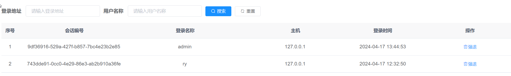


事实上，在线用户的实现非常简单！因为每一个在线用户的`token`被存储在Redis中的，并且它们都有一个前缀`login_tokens`，所以可以一键获取到全部在线用户，代码如下，开始debug：


```java
@RequiresPermissions("monitor:online:list")
@GetMapping("/list")
public TableDataInfo list(String ipaddr, String userName)
{
    Collection<String> keys = redisService.keys(CacheConstants.LOGIN_TOKEN_KEY + "*");
    List<SysUserOnline> userOnlineList = new ArrayList<SysUserOnline>();
    for (String key : keys)
    {
        LoginUser user = redisService.getCacheObject(key);
        if (StringUtils.isNotEmpty(ipaddr) && StringUtils.isNotEmpty(userName))
        {
            userOnlineList.add(userOnlineService.selectOnlineByInfo(ipaddr, userName, user));
        }
        else if (StringUtils.isNotEmpty(ipaddr))
        {
            userOnlineList.add(userOnlineService.selectOnlineByIpaddr(ipaddr, user));
        }
        else if (StringUtils.isNotEmpty(userName))
        {
            userOnlineList.add(userOnlineService.selectOnlineByUserName(userName, user));
        }
        else
        {
            userOnlineList.add(userOnlineService.loginUserToUserOnline(user));
        }
    }
    Collections.reverse(userOnlineList);
    userOnlineList.removeAll(Collections.singleton(null));
    return getDataTable(userOnlineList);
}
```

## 20.1 强退用户

强退只需要把token给扔了就行了，下次该用户访问的时候，就会被返回没有权限401，响应拦截器会安排他。

```java
/**
 * 强退用户
 */
@RequiresPermissions("monitor:online:forceLogout")
@Log(title = "在线用户", businessType = BusinessType.FORCE)
@DeleteMapping("/{tokenId}")
public AjaxResult forceLogout(@PathVariable String tokenId)
{
    redisService.deleteObject(CacheConstants.LOGIN_TOKEN_KEY + tokenId);
    return success();
}
```

# 二十一、Admin控制台

http://doc.ruoyi.vip/ruoyi-cloud/cloud/monitor.html#%E5%9F%BA%E6%9C%AC%E4%BB%8B%E7%BB%8D


```yml
management:
  endpoints:
    web:
      exposure:
        include: '*'
```

具体来说：

- `management`：表示配置 Spring Boot Actuator 相关的管理功能。
- `endpoints`：表示配置管理端点。
- `web`：表示配置 Web 端点。
- `exposure`：表示配置端点的暴露策略。
- `include: '*'`：表示将所有端点都暴露出来，即允许外部访问所有的管理端点。

这段配置的作用是允许所有的管理端点都对外部暴露，这样可以让监控工具或管理系统访问这些端点获取系统的运行状态、健康检查、配置信息等。需要注意的是，对于一些敏感的端点，比如 `/actuator/env`、`/actuator/configprops` 等，如果暴露出来可能会导致安全风险，因此在生产环境中建议根据实际需求仔细配置端点的暴露策略。


## 21.1 启动minitor

修改配置文件，主要是注册中心和配置中心的配置。

```yml
# Tomcat
server:
  port: 9100

# Spring
spring: 
  application:
    # 应用名称
    name: ruoyi-monitor
  profiles:
    # 环境配置
    active: dev
  cloud:
    nacos:
      discovery:
        # 服务注册地址
        server-addr: 154.211.15.157:8848
      config:
        # 配置中心地址
        server-addr: 154.211.15.157:8848
        # 配置文件格式
        file-extension: yml
        # 共享配置
        shared-configs:
          - application-${spring.profiles.active}.${spring.cloud.nacos.config.file-extension}
```

而后直接启动即可。


看日志的时候，需要重启服务器。日志界面：

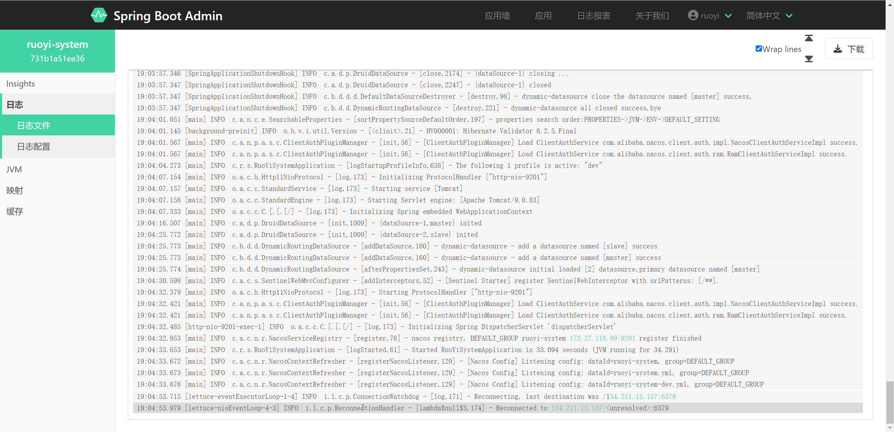


# 二十二、Sentinel熔断、降级

http://doc.ruoyi.vip/ruoyi-cloud/cloud/sentinel.html#%E5%9F%BA%E6%9C%AC%E4%BB%8B%E7%BB%8D


sentinel的流控策略属于SpringCloud的基础内容，这里不再赘述。

但是，这里把sentinel搭建起来。


配置文件修改【**在配置中心的application-dev.yml修改，可以大家都有份**】：

```yml
# Spring
spring:
  cloud:
    sentinel:
      # 取消控制台懒加载
      eager: true
      transport:
        # 控制台地址
        dashboard: 127.0.0.1:8718
```

启动sentinel客户端：

```sh
java -Dserver.port=8718   -Dcsp.sentinel.dashboard.server=localhost:8718  -Dproject.name=sentinel-dashboard -Dcsp.sentinel.api.port=8719    -jar sentinel-dashboard-1.8.7.jar

```

启动成功截图：

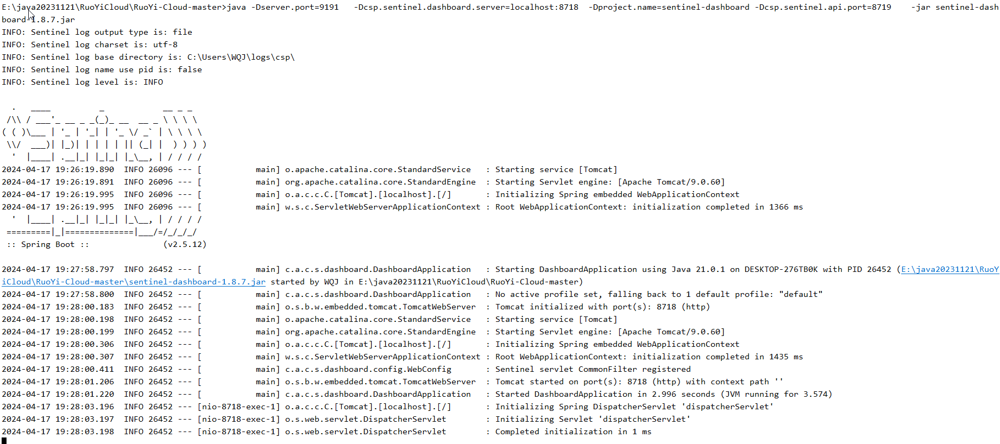


随意设置一个规则，试试：

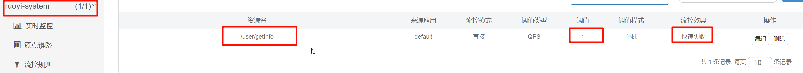


配合apipost和浏览器完成压测。


经过测试，流控完成：

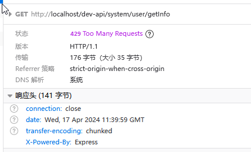

测试完毕，删除不必要的规则：

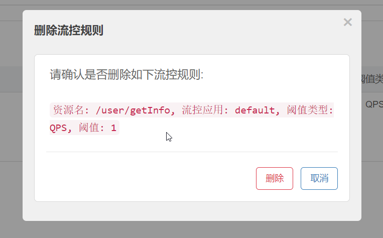


# 二十三、新建微服务并发生服务之间调用


## 23.1 自带openfeign的服务

新建` ruoyi-test1 `微服务，然后写一个接口，企图调用，先让服务经过`gateway`做转发，然后转发到`ruoyi-test1`微服务，然后`ruoyi-test1`去调用`用户管理`获取全部的用户，然后打印在控制台上。


### 23.1.1 项目的建立与测试

1. pom文件修改

在`ruoyi-modules`父项目下面新建子模块`ruoyi-test1`，然后修改`artifactId`，引入`依赖`，修改`build`。


```xml
<?xml version="1.0" encoding="UTF-8"?>
<project xmlns="http://maven.apache.org/POM/4.0.0"
         xmlns:xsi="http://www.w3.org/2001/XMLSchema-instance"
         xsi:schemaLocation="http://maven.apache.org/POM/4.0.0 http://maven.apache.org/xsd/maven-4.0.0.xsd">
    <modelVersion>4.0.0</modelVersion>
    <parent>
        <groupId>com.ruoyi</groupId>
        <artifactId>ruoyi-modules</artifactId>
        <version>3.6.4</version>
    </parent>

    <artifactId>ruoyi-modules-test1</artifactId>


    <dependencies>
        <!-- SpringCloud Alibaba Nacos -->
        <dependency>
            <groupId>com.alibaba.cloud</groupId>
            <artifactId>spring-cloud-starter-alibaba-nacos-discovery</artifactId>
        </dependency>

        <!-- SpringCloud Alibaba Nacos Config -->
        <dependency>
            <groupId>com.alibaba.cloud</groupId>
            <artifactId>spring-cloud-starter-alibaba-nacos-config</artifactId>
        </dependency>
        <!-- SpringCloud Alibaba Sentinel -->
        <dependency>
            <groupId>com.alibaba.cloud</groupId>
            <artifactId>spring-cloud-starter-alibaba-sentinel</artifactId>
        </dependency>

        <!-- SpringBoot Actuator -->
        <dependency>
            <groupId>org.springframework.boot</groupId>
            <artifactId>spring-boot-starter-actuator</artifactId>
        </dependency>

        <!-- Swagger UI -->
        <dependency>
            <groupId>io.springfox</groupId>
            <artifactId>springfox-swagger-ui</artifactId>
            <version>${swagger.fox.version}</version>
        </dependency>

        <!-- RuoYi Common Swagger -->
        <dependency>
            <groupId>com.ruoyi</groupId>
            <artifactId>ruoyi-common-swagger</artifactId>
        </dependency>

        <dependency>
            <groupId>com.ruoyi</groupId>
            <artifactId>ruoyi-common-security</artifactId>
        </dependency>

        <!-- Mysql Connector -->
        <dependency>
            <groupId>com.mysql</groupId>
            <artifactId>mysql-connector-j</artifactId>
        </dependency>

        <!-- RuoYi Common DataSource -->
        <dependency>
            <groupId>com.ruoyi</groupId>
            <artifactId>ruoyi-common-datasource</artifactId>
        </dependency>

        <dependency>
            <groupId>com.ruoyi</groupId>
            <artifactId>ruoyi-api-system</artifactId>
        </dependency>
    </dependencies>


    <build>
        <finalName>${project.artifactId}</finalName>
        <plugins>
            <plugin>
                <groupId>org.springframework.boot</groupId>
                <artifactId>spring-boot-maven-plugin</artifactId>
                <executions>
                    <execution>
                        <goals>
                            <goal>repackage</goal>
                        </goals>
                    </execution>
                </executions>
            </plugin>
        </plugins>
    </build>
</project>

```

2. 漂亮妹妹（banner.txt）

```
Spring Boot Version: ${spring-boot.version}
Spring Application Name: ${spring.application.name}
我是王清江！
```

3. bootstrap.yml

```yml
# Tomcat
server:
  port: 9902

# Spring
spring:
  application:
    # 应用名称
    name: ruoyi-test1
  profiles:
    # 环境配置
    active: dev
  cloud:
    nacos:
      discovery:
        # 服务注册地址
        server-addr: 154.211.15.157:8848
      config:
        # 配置中心地址
        server-addr: 154.211.15.157:8848
        # 配置文件格式
        file-extension: yml
        # 共享配置
        shared-configs:
          - application-${spring.profiles.active}.${spring.cloud.nacos.config.file-extension}
```

4.  logback.xml

```xml
<?xml version="1.0" encoding="UTF-8"?>
<configuration scan="true" scanPeriod="60 seconds" debug="false">
    <!-- 日志存放路径 -->
    <property name="log.path" value="logs/ruoyi-test1" />
   <!-- 日志输出格式 -->
    <property name="log.pattern" value="%d{HH:mm:ss.SSS} [%thread] %-5level %logger{20} - [%method,%line] - %msg%n" />

    <!-- 控制台输出 -->
    <appender name="console" class="ch.qos.logback.core.ConsoleAppender">
       <encoder>
          <pattern>${log.pattern}</pattern>
       </encoder>
    </appender>

    <!-- 系统日志输出 -->
    <appender name="file_info" class="ch.qos.logback.core.rolling.RollingFileAppender">
        <file>${log.path}/info.log</file>
        <!-- 循环政策：基于时间创建日志文件 -->
       <rollingPolicy class="ch.qos.logback.core.rolling.TimeBasedRollingPolicy">
            <!-- 日志文件名格式 -->
          <fileNamePattern>${log.path}/info.%d{yyyy-MM-dd}.log</fileNamePattern>
          <!-- 日志最大的历史 60天 -->
          <maxHistory>60</maxHistory>
       </rollingPolicy>
       <encoder>
          <pattern>${log.pattern}</pattern>
       </encoder>
       <filter class="ch.qos.logback.classic.filter.LevelFilter">
            <!-- 过滤的级别 -->
            <level>INFO</level>
            <!-- 匹配时的操作：接收（记录） -->
            <onMatch>ACCEPT</onMatch>
            <!-- 不匹配时的操作：拒绝（不记录） -->
            <onMismatch>DENY</onMismatch>
        </filter>
    </appender>

    <appender name="file_error" class="ch.qos.logback.core.rolling.RollingFileAppender">
        <file>${log.path}/error.log</file>
        <!-- 循环政策：基于时间创建日志文件 -->
        <rollingPolicy class="ch.qos.logback.core.rolling.TimeBasedRollingPolicy">
            <!-- 日志文件名格式 -->
            <fileNamePattern>${log.path}/error.%d{yyyy-MM-dd}.log</fileNamePattern>
          <!-- 日志最大的历史 60天 -->
          <maxHistory>60</maxHistory>
        </rollingPolicy>
        <encoder>
            <pattern>${log.pattern}</pattern>
        </encoder>
        <filter class="ch.qos.logback.classic.filter.LevelFilter">
            <!-- 过滤的级别 -->
            <level>ERROR</level>
          <!-- 匹配时的操作：接收（记录） -->
            <onMatch>ACCEPT</onMatch>
          <!-- 不匹配时的操作：拒绝（不记录） -->
            <onMismatch>DENY</onMismatch>
        </filter>
    </appender>

    <!-- 系统模块日志级别控制  -->
    <logger name="com.ruoyi" level="debug" />
    <!-- Spring日志级别控制  -->
    <logger name="org.springframework" level="warn" />

    <root level="info">
       <appender-ref ref="console" />
    </root>

    <!--系统操作日志-->
    <root level="info">
        <appender-ref ref="file_info" />
        <appender-ref ref="file_error" />
    </root>
</configuration>
```

5. 在nacos新建配置文件`ruoyi-test1-dev.yml`，并填充`aa`用于测试配置中心是否生效

```yml
aa: 我是小哥哥哦
```

6. 写启动类：

```java
package com.ruoyi.test1;

import org.springframework.beans.factory.annotation.Value;
import org.springframework.boot.SpringApplication;
import org.springframework.boot.autoconfigure.SpringBootApplication;
import org.springframework.cloud.context.config.annotation.RefreshScope;
import org.springframework.web.bind.annotation.GetMapping;
import org.springframework.web.bind.annotation.RestController;

/**
 * 系统模块
 *
 * @author ruoyi
 */
@SpringBootApplication
@RefreshScope
@RestController
public class RuoYiTest1Application {
    public static void main(String[] args) {
        SpringApplication.run(RuoYiTest1Application.class, args);
        System.out.println("(♥◠‿◠)ﾉﾞ  Test1模块   ლ(´ڡ`ლ)ﾞ  \n" +
                " .-------.       ____     __        \n" +
                " |  _ _   \\      \\   \\   /  /    \n" +
                " | ( ' )  |       \\  _. /  '       \n" +
                " |(_ o _) /        _( )_ .'         \n" +
                " | (_,_).' __  ___(_ o _)'          \n" +
                " |  |\\ \\  |  ||   |(_,_)'         \n" +
                " |  | \\ `'   /|   `-'  /           \n" +
                " |  |  \\    /  \\      /           \n" +
                " ''-'   `'-'    `-..-'              ");
    }


    @Value("${aa}")
    private String aa;


    @GetMapping("/test2")
    public void test() {
        System.out.println(aa);
    }


}
```

7. 运行`ruoyi-test1`微服务，启动成功：

```log
21:03:40.596 [main] INFO  c.a.n.c.e.SearchableProperties - [sortPropertySourceDefaultOrder,197] - properties search order:PROPERTIES->JVM->ENV->DEFAULT_SETTING
21:03:40.674 [background-preinit] INFO  o.h.v.i.util.Version - [<clinit>,21] - HV000001: Hibernate Validator 6.2.5.Final
21:03:41.040 [main] INFO  c.a.n.p.a.s.c.ClientAuthPluginManager - [init,56] - [ClientAuthPluginManager] Load ClientAuthService com.alibaba.nacos.client.auth.impl.NacosClientAuthServiceImpl success.
21:03:41.040 [main] INFO  c.a.n.p.a.s.c.ClientAuthPluginManager - [init,56] - [ClientAuthPluginManager] Load ClientAuthService com.alibaba.nacos.client.auth.ram.RamClientAuthServiceImpl success.
Spring Boot Version: 2.7.18
Spring Application Name: ruoyi-test1
我是王清江！

21:03:42.871 [main] WARN  c.a.c.n.c.NacosPropertySourceBuilder - [loadNacosData,87] - Ignore the empty nacos configuration and get it based on dataId[ruoyi-test1] & group[DEFAULT_GROUP]
21:03:42.973 [main] WARN  c.a.c.n.c.NacosPropertySourceBuilder - [loadNacosData,87] - Ignore the empty nacos configuration and get it based on dataId[ruoyi-test1.yml] & group[DEFAULT_GROUP]
21:03:43.105 [main] INFO  c.r.t.RuoYiTest1Application - [logStartupProfileInfo,638] - The following 1 profile is active: "dev"
21:03:44.315 [main] WARN  o.m.s.m.ClassPathMapperScanner - [warn,44] - No MyBatis mapper was found in '[com.ruoyi.test1]' package. Please check your configuration.
21:03:45.416 [main] INFO  o.a.c.h.Http11NioProtocol - [log,173] - Initializing ProtocolHandler ["http-nio-9905"]
21:03:45.420 [main] INFO  o.a.c.c.StandardService - [log,173] - Starting service [Tomcat]
21:03:45.420 [main] INFO  o.a.c.c.StandardEngine - [log,173] - Starting Servlet engine: [Apache Tomcat/9.0.83]
21:03:45.600 [main] INFO  o.a.c.c.C.[.[.[/] - [log,173] - Initializing Spring embedded WebApplicationContext
21:03:52.313 [main] INFO  c.a.d.p.DruidDataSource - [init,1009] - {dataSource-1,master} inited
21:03:57.106 [main] INFO  c.a.d.p.DruidDataSource - [init,1009] - {dataSource-2,slave} inited
21:03:57.107 [main] INFO  c.b.d.d.DynamicRoutingDataSource - [addDataSource,160] - dynamic-datasource - add a datasource named [slave] success
21:03:57.107 [main] INFO  c.b.d.d.DynamicRoutingDataSource - [addDataSource,160] - dynamic-datasource - add a datasource named [master] success
21:03:57.108 [main] INFO  c.b.d.d.DynamicRoutingDataSource - [afterPropertiesSet,243] - dynamic-datasource initial loaded [2] datasource,primary datasource named [master]
21:03:57.661 [main] INFO  c.a.c.s.SentinelWebMvcConfigurer - [addInterceptors,52] - [Sentinel Starter] register SentinelWebInterceptor with urlPatterns: [/**].
INFO: Sentinel log output type is: file
INFO: Sentinel log charset is: utf-8
INFO: Sentinel log base directory is: C:\Users\WQJ\logs\csp\
INFO: Sentinel log name use pid is: false
INFO: Sentinel log level is: INFO
21:03:59.215 [main] WARN  o.s.c.l.c.LoadBalancerCacheAutoConfiguration$LoadBalancerCaffeineWarnLogger - [logWarning,83] - Spring Cloud LoadBalancer is currently working with the default cache. While this cache implementation is useful for development and tests, it's recommended to use Caffeine cache in production.You can switch to using Caffeine cache, by adding it and org.springframework.cache.caffeine.CaffeineCacheManager to the classpath.
21:03:59.385 [main] INFO  o.a.c.h.Http11NioProtocol - [log,173] - Starting ProtocolHandler ["http-nio-9905"]
21:03:59.418 [main] INFO  c.a.n.p.a.s.c.ClientAuthPluginManager - [init,56] - [ClientAuthPluginManager] Load ClientAuthService com.alibaba.nacos.client.auth.impl.NacosClientAuthServiceImpl success.
21:03:59.418 [main] INFO  c.a.n.p.a.s.c.ClientAuthPluginManager - [init,56] - [ClientAuthPluginManager] Load ClientAuthService com.alibaba.nacos.client.auth.ram.RamClientAuthServiceImpl success.
21:04:00.013 [main] INFO  c.a.c.n.r.NacosServiceRegistry - [register,76] - nacos registry, DEFAULT_GROUP ruoyi-test1 172.27.118.99:9905 register finished
21:04:00.038 [main] INFO  c.r.t.RuoYiTest1Application - [logStarted,61] - Started RuoYiTest1Application in 19.906 seconds (JVM running for 20.861)
21:04:00.055 [main] INFO  c.a.c.n.r.NacosContextRefresher - [registerNacosListener,129] - [Nacos Config] Listening config: dataId=ruoyi-test1-dev.yml, group=DEFAULT_GROUP
21:04:00.056 [main] INFO  c.a.c.n.r.NacosContextRefresher - [registerNacosListener,129] - [Nacos Config] Listening config: dataId=ruoyi-test1.yml, group=DEFAULT_GROUP
21:04:00.056 [main] INFO  c.a.c.n.r.NacosContextRefresher - [registerNacosListener,129] - [Nacos Config] Listening config: dataId=ruoyi-test1, group=DEFAULT_GROUP
(♥◠‿◠)ﾉﾞ  Test1模块   ლ(´ڡ`ლ)ﾞ  
 .-------.       ____     __        
 |  _ _   \      \   \   /  /    
 | ( ' )  |       \  _. /  '       
 |(_ o _) /        _( )_ .'         
 | (_,_).' __  ___(_ o _)'          
 |  |\ \  |  ||   |(_,_)'         
 |  | \ `'   /|   `-'  /           
 |  |  \    /  \      /           
 ''-'   `'-'    `-..-'              
21:04:00.281 [RMI TCP Connection(3)-192.168.137.1] INFO  o.a.c.c.C.[.[.[/] - [log,173] - Initializing Spring DispatcherServlet 'dispatcherServlet'
```


8. 检查nacos中服务是否注册：

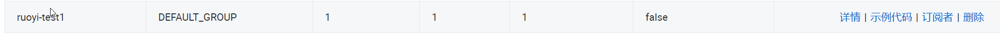

9. 测试`test2`接口，看看是否能访问到`aa`的值

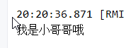

10. 刷新nacos的配置中心的值，被刷新：

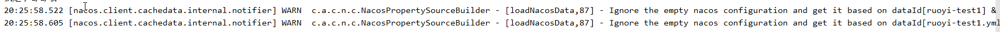

11. 再次测试`test2`接口，正常使用：

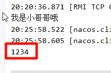

### 23.1.2 openfeign接口

1. 修改头信息注入器

```Java
package com.ruoyi.common.security.interceptor;

import javax.servlet.http.HttpServletRequest;
import javax.servlet.http.HttpServletResponse;
import org.springframework.web.method.HandlerMethod;
import org.springframework.web.servlet.AsyncHandlerInterceptor;
import com.ruoyi.common.core.constant.SecurityConstants;
import com.ruoyi.common.core.context.SecurityContextHolder;
import com.ruoyi.common.core.utils.ServletUtils;
import com.ruoyi.common.core.utils.StringUtils;
import com.ruoyi.common.security.auth.AuthUtil;
import com.ruoyi.common.security.utils.SecurityUtils;
import com.ruoyi.system.api.model.LoginUser;

/**
 * 自定义请求头拦截器，将Header数据封装到线程变量中方便获取
 * 注意：此拦截器会同时验证当前用户有效期自动刷新有效期
 *
 * @author ruoyi
 */
public class HeaderInterceptor implements AsyncHandlerInterceptor
{
    @Override
    public boolean preHandle(HttpServletRequest request, HttpServletResponse response, Object handler) throws Exception
    {
        if (!(handler instanceof HandlerMethod))
        {
            return true;
        }

        SecurityContextHolder.setUserId(ServletUtils.getHeader(request, SecurityConstants.DETAILS_USER_ID));
        SecurityContextHolder.setUserName(ServletUtils.getHeader(request, SecurityConstants.DETAILS_USERNAME));
        SecurityContextHolder.setUserKey(ServletUtils.getHeader(request, SecurityConstants.USER_KEY));
        SecurityContextHolder.setToken(ServletUtils.getHeader(request, SecurityConstants.TOKEN));   //王清江添加，目的是让token可以在服务调用期间不断传递

        String token = SecurityUtils.getToken();
        if (StringUtils.isNotEmpty(token))
        {
            LoginUser loginUser = AuthUtil.getLoginUser(token);
            if (StringUtils.isNotNull(loginUser))
            {
                AuthUtil.verifyLoginUserExpire(loginUser);
                SecurityContextHolder.set(SecurityConstants.LOGIN_USER, loginUser);
            }
        }
        return true;
    }

    @Override
    public void afterCompletion(HttpServletRequest request, HttpServletResponse response, Object handler, Exception ex)
            throws Exception
    {
        SecurityContextHolder.remove();
    }
}
```

那么记得补充setToken和getToken的方法（SecurityContextHolder.java）：

```java
public static void setToken(String token)  //补充setToken
{
    set(SecurityConstants.TOKEN, token);
}

public static String getToken() //补充getToken
{
    return get(SecurityConstants.TOKEN);
}
```

顺便要给出常量（SecurityConstants.java）：

```java
public static final String TOKEN = "Authorization";
```

2. 修改启动类，打开openfeign

```java
package com.ruoyi.test1;

import com.ruoyi.common.security.annotation.EnableRyFeignClients;
import com.ruoyi.common.security.annotation.EnableWqjFeignClients;
import org.springframework.beans.factory.annotation.Value;
import org.springframework.boot.SpringApplication;
import org.springframework.boot.autoconfigure.SpringBootApplication;
import org.springframework.cloud.context.config.annotation.RefreshScope;
import org.springframework.web.bind.annotation.GetMapping;
import org.springframework.web.bind.annotation.RestController;

/**
 * 系统模块
 *
 * @author ruoyi
 */
@SpringBootApplication
@RefreshScope
@RestController
@EnableRyFeignClients
public class RuoYiTest1Application {
    public static void main(String[] args) {
        SpringApplication.run(RuoYiTest1Application.class, args);
        System.out.println("(♥◠‿◠)ﾉﾞ  Test1模块   ლ(´ڡ`ლ)ﾞ  \n" +
                " .-------.       ____     __        \n" +
                " |  _ _   \\      \\   \\   /  /    \n" +
                " | ( ' )  |       \\  _. /  '       \n" +
                " |(_ o _) /        _( )_ .'         \n" +
                " | (_,_).' __  ___(_ o _)'          \n" +
                " |  |\\ \\  |  ||   |(_,_)'         \n" +
                " |  | \\ `'   /|   `-'  /           \n" +
                " |  |  \\    /  \\      /           \n" +
                " ''-'   `'-'    `-..-'              ");
    }


    @Value("${aa}")
    private String aa;


    @GetMapping("/test2")
    public void test() {
        System.out.println(aa);
    }


}
```

3. 修改`RemoteUserService.java`假客户端

```java
package com.ruoyi.system.api;

import com.ruoyi.common.core.web.page.TableDataInfo;
import org.springframework.cloud.openfeign.FeignClient;
import org.springframework.web.bind.annotation.GetMapping;
import org.springframework.web.bind.annotation.PathVariable;
import org.springframework.web.bind.annotation.PostMapping;
import org.springframework.web.bind.annotation.RequestBody;
import org.springframework.web.bind.annotation.RequestHeader;
import com.ruoyi.common.core.constant.SecurityConstants;
import com.ruoyi.common.core.constant.ServiceNameConstants;
import com.ruoyi.common.core.domain.R;
import com.ruoyi.system.api.domain.SysUser;
import com.ruoyi.system.api.factory.RemoteUserFallbackFactory;
import com.ruoyi.system.api.model.LoginUser;

/**
 * 用户服务
 *
 * @author ruoyi
 */
@FeignClient(contextId = "remoteUserService", value = ServiceNameConstants.SYSTEM_SERVICE, fallbackFactory = RemoteUserFallbackFactory.class)
public interface RemoteUserService {
    /**
     * 通过用户名查询用户信息
     *
     * @param username 用户名
     * @param source   请求来源
     * @return 结果
     */
    @GetMapping("/user/info/{username}")
    public R<LoginUser> getUserInfo(@PathVariable("username") String username, @RequestHeader(SecurityConstants.FROM_SOURCE) String source);


    @GetMapping("/user/list") // 新增用户管理的接口
    public TableDataInfo getUserList(@RequestHeader(SecurityConstants.DETAILS_USER_ID) Long userId,
                                     @RequestHeader(SecurityConstants.DETAILS_USERNAME) String userName,
                                     @RequestHeader(SecurityConstants.USER_KEY) String userKey,
                                     @RequestHeader(SecurityConstants.TOKEN) String token
    );


    /**
     * 注册用户信息
     *
     * @param sysUser 用户信息
     * @param source  请求来源
     * @return 结果
     */
    @PostMapping("/user/register")
    public R<Boolean> registerUserInfo(@RequestBody SysUser sysUser, @RequestHeader(SecurityConstants.FROM_SOURCE) String source);
}
```

4. 写Controller调用假客户端

```java
package com.ruoyi.test1.controller;

import com.ruoyi.common.core.context.SecurityContextHolder;
import com.ruoyi.common.core.web.page.TableDataInfo;
import com.ruoyi.system.api.RemoteUserService;
import com.ruoyi.system.api.domain.SysUser;
import org.springframework.beans.factory.annotation.Autowired;
import org.springframework.web.bind.annotation.GetMapping;
import org.springframework.web.bind.annotation.RestController;

import java.util.LinkedHashMap;
import java.util.List;

@RestController("/")
public class MyController {

    @Autowired
    private RemoteUserService remoteUserService;

    @GetMapping("/getUserList")
    public void test() {
        TableDataInfo userList = remoteUserService.getUserList(SecurityContextHolder.getUserId(),
                SecurityContextHolder.getUserName(),
                SecurityContextHolder.getUserKey(),
                SecurityContextHolder.getToken());

        List<LinkedHashMap<String, Object>> rows = (List<LinkedHashMap<String, Object>>) userList.getRows();
        for (LinkedHashMap<String, Object> row : rows) {
            System.out.println("row = " + row);
        }

    }

}

```

5. apipost调用接口`http://localhost:8080/xxx/getUserList`

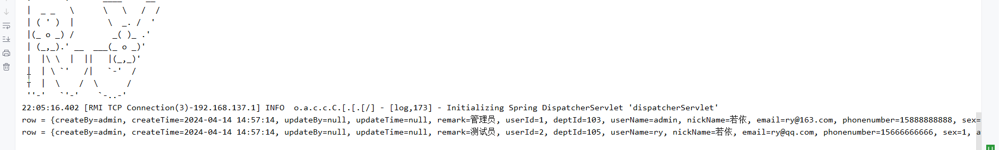


以上写好之后，需要全程debug，主要是看token添加的作用，目的就是为了通过鉴权。


可能的疑问：

为啥调用openfeign后的实体类数据变成了linkedhashmap:

https://www.google.com/search?q=%E4%B8%BA%E5%95%A5%E8%B0%83%E7%94%A8openfeign%E5%90%8E%E7%9A%84%E5%AE%9E%E4%BD%93%E7%B1%BB%E6%95%B0%E6%8D%AE%E5%8F%98%E6%88%90%E4%BA%86linkedhashmap&oq=%E4%B8%BA%E5%95%A5%E8%B0%83%E7%94%A8openfeign%E5%90%8E%E7%9A%84%E5%AE%9E%E4%BD%93%E7%B1%BB%E6%95%B0%E6%8D%AE%E5%8F%98%E6%88%90%E4%BA%86linkedhashmap&gs_lcrp=EgZjaHJvbWUyBggAEEUYOdIBCTM0MTY4ajBqN6gCALACAA&sourceid=chrome&ie=UTF-8

## 23.2 手写openfeign的服务

下面，手撕一个openfeign，用来调用在线用户，然后打印在线用户来玩一玩：


1. 手撕openfeign假客户端

```java
package com.ruoyi.system.api;

import com.ruoyi.common.core.constant.SecurityConstants;
import com.ruoyi.common.core.constant.ServiceNameConstants;
import com.ruoyi.common.core.web.page.TableDataInfo;
import com.ruoyi.system.api.factory.RemoteOnlineUserFallbackFactory;
import org.springframework.cloud.openfeign.FeignClient;
import org.springframework.web.bind.annotation.GetMapping;
import org.springframework.web.bind.annotation.RequestHeader;

@FeignClient(contextId = "remoteOnlineUserService", value = ServiceNameConstants.SYSTEM_SERVICE, fallbackFactory = RemoteOnlineUserFallbackFactory.class)
public interface RemoteOnlineUserService {

    @GetMapping("/online/list")
    public TableDataInfo getOnlineUserList(@RequestHeader(SecurityConstants.TOKEN) String token);


}
```

2. 写兜底方法

```java
package com.ruoyi.system.api.factory;

import com.ruoyi.common.core.web.page.TableDataInfo;
import com.ruoyi.system.api.RemoteOnlineUserService;
import org.slf4j.Logger;
import org.slf4j.LoggerFactory;
import org.springframework.cloud.openfeign.FallbackFactory;

public class RemoteOnlineUserFallbackFactory implements FallbackFactory<RemoteOnlineUserService> {
    private static final Logger log = LoggerFactory.getLogger(RemoteOnlineUserFallbackFactory.class);

    @Override
    public RemoteOnlineUserService create(Throwable throwable) {
        log.error("用户服务调用失败:{}", throwable.getMessage());
        return new RemoteOnlineUserService() {
            @Override
            public TableDataInfo getOnlineUserList(String token) {
                TableDataInfo info = new TableDataInfo();
                info.setMsg("获取在线用户列表失败：" + throwable.getMessage());
                return info;
            }
        };
    }
}
```

3. 把兜底类注入Spring容器

`org.springframework.boot.autoconfigure.AutoConfiguration.imports` 文件中操作

```
com.ruoyi.system.api.factory.RemoteOnlineUserFallbackFactory
```

4. 写接口调用

```java
@Autowired
private RemoteOnlineUserService remoteOnlineUserService;

@GetMapping("/getOnlineUserList")
public void test1() {
    TableDataInfo onlineUserList = remoteOnlineUserService.getOnlineUserList(SecurityContextHolder.getToken());
    List<LinkedHashMap<String, Object>> rows = (List<LinkedHashMap<String, Object>>) onlineUserList.getRows();
    for (LinkedHashMap<String, Object> row : rows) {
        System.out.println("row = " + row);
    }

}
```

5. 接口调用试试

http://localhost:8080/xxx/getOnlineUserList

调用成功的截图：

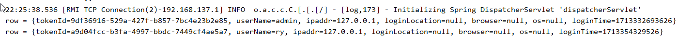


最后，关闭`ruoyi-test1`微服务，省得浪费内存


# 二十四、定时任务


先启动启动定时任务的微服务`ruoyi-job`

1. 修改YML，写注册中心和配置中心的信息

```yml
# Tomcat
server:
  port: 9203

# Spring
spring: 
  application:
    # 应用名称
    name: ruoyi-job
  profiles:
    # 环境配置
    active: dev
  cloud:
    nacos:
      discovery:
        # 服务注册地址
        server-addr: 154.211.15.157:8848
      config:
        # 配置中心地址
        server-addr: 154.211.15.157:8848
        # 配置文件格式
        file-extension: yml
        # 共享配置
        shared-configs:
          - application-${spring.profiles.active}.${spring.cloud.nacos.config.file-extension}
```

2. nacos配置文件修改：[注意：job没有引入多数据源！]

```yaml
# spring配置
spring:
  redis:
    host: 154.211.15.157
    port: 6379
    password: dfasf15asfasd56fas51
    database: 10
  datasource:
    driver-class-name: com.mysql.cj.jdbc.Driver
    url: jdbc:mysql://154.211.15.157:3306/ry-cloud1?useUnicode=true&characterEncoding=utf8&zeroDateTimeBehavior=convertToNull&useSSL=true&serverTimezone=GMT%2B8
    username: ry-cloud1
    password: 4x7N5x3msrjNNtwF

# mybatis配置
mybatis:
    # 搜索指定包别名
    typeAliasesPackage: com.ruoyi.job.domain
    # 配置mapper的扫描，找到所有的mapper.xml映射文件
    mapperLocations: classpath:mapper/**/*.xml

# swagger配置
swagger:
  title: 定时任务接口文档
  license: Powered By ruoyi
  licenseUrl: https://ruoyi.vip

```

3. 启动`RuoYiJobApplication.java`即可。


两个任务，第一个随便一个方法运行

1. 调用无参函数

`ryTask.ryNoParams`

`bean名.方法名`

2. 调用单个参数

`ryTask.ryParams('ry')`

`bean名.方法名`，字符串参数用引号

2. 调用多个参数

`ryTask.ryMultipleParams('ry', true, 2000L, 316.50D, 100)`

布尔值直接写true、false；Long用L结尾，D为Double，100当然为int


http://doc.ruoyi.vip/ruoyi/document/htsc.html#%E5%AE%9A%E6%97%B6%E4%BB%BB%E5%8A%A1

## 24.1 cron表达式

Cron 是一种时间表达式，通常用于在 Unix 和类 Unix 系统中调度任务。它是一种基于时间的调度工具，可以精确地指定任务在何时执行。Cron 表达式由 6 个字段组成，分别表示秒、分钟、小时、日期、月份和星期几。每个字段都可以设置为一个具体的值、一组值、一个范围或者使用通配符来表示。

下面是 Cron 表达式的各个字段及其含义：

1. **秒（Seconds）：** 允许值范围为 0-59。
2. **分钟（Minutes）：** 允许值范围为 0-59。
3. **小时（Hours）：** 允许值范围为 0-23。
4. **日期（Day of month）：** 允许值范围为 1-31。
5. **月份（Month）：** 允许值范围为 1-12 或者使用缩写（JAN、FEB、MAR 等）。
6. **星期几（Day of week）：** 允许值范围为 0-7 或者使用缩写（SUN、MON、TUE 等，0 和 7 都表示星期天）。

Cron 表达式的格式为：`秒 分 时 日 月 周`，其中各个字段可以使用以下特殊符号来表示：

- `*`：表示任意值，比如 `*` 表示每秒、每分钟、每小时等。
- `/`：表示间隔，比如 `*/5` 表示每隔 5 秒、每隔 5 分钟等。
- `-`：表示范围，比如 `1-10` 表示 1 到 10，`MON-FRI` 表示星期一到星期五。
- `,`：表示枚举值，比如 `1,3,5` 表示 1、3、5。
- `?`：用于表示日或星期几中的某一个字段为空，可以使用 `?` 或者 `*`。
- `L`：表示最后一天，比如 `L` 表示月份的最后一天，`6L` 表示月份的倒数第六天。
- `W`：表示工作日（周一到周五），比如 `15W` 表示离月份的第 15 天最近的工作日。
- `#`：表示第几个星期几，比如 `2#1` 表示每月的第一个星期一。

例如，下面是一些常见的 Cron 表达式示例：

- `0 0 0 * * ?`：每天凌晨 12 点执行。
- `0 0/5 * * * ?`：每隔 5 分钟执行一次。
- `0 0 12 * * ?`：每天中午 12 点执行。
- `0 15 10 ? * MON-FRI`：每周一到周五的上午 10 点 15 分执行。
- `0 0 6 1 * ?`：每月的第一天上午 6 点执行。

需要注意的是，Cron 表达式的语法比较灵活，可以根据具体的需求来进行定制。在使用 Cron 表达式时，建议先进行测试验证，确保任务按照预期的时间执行。

## 24.2 定时任务的运用场景

定时任务在软件开发中有许多实际的运用场景，其中一些常见的场景包括：

1. **数据备份和清理：** 可以定时执行数据备份任务，将重要数据定期备份到远程或本地存储，以防止数据丢失。另外，定时清理过期或无用的数据也是一种常见的定时任务场景。

2. **定时报表生成：** 对于需要定期生成报表的业务，可以设置定时任务来生成报表并发送给相关人员或保存到指定位置。

3. **缓存更新：** 定时任务可以用于定期更新缓存数据，保持缓存与数据源的一致性，并且可以减轻数据源的压力。

4. **邮件发送：** 可以定时发送邮件通知，比如每天早上发送日报邮件、每周发送周报邮件等。

5. **定时监控和预警：** 可以定时执行监控任务，检查系统状态、性能指标等，并根据设定的规则发送预警通知。

6. **自动化任务：** 定时任务可以用于执行各种自动化任务，比如定时执行数据导入导出、定时执行数据处理和分析等。

7. **定时任务调度：** 在分布式系统中，定时任务可以用于任务调度和分发，实现定时触发任务的执行。

8. **定时更新配置：** 定时任务可以用于定期更新配置信息，比如从配置中心拉取最新配置并更新应用。

总的来说，定时任务适用于各种需要定期执行、自动化处理的任务场景，能够提高系统的可靠性、稳定性和效率，减少人工干预的工作量，是软件开发中常用的一种技术手段。


**关闭定时任务微服务，节省内存。**

# 二十五、Excel导入

全文涉及到Excel导入的地方只有用户管理的导入用户，导入用户是非常常见的一个任务。

例如一个大学的教务系统，学生的账号密码都不是学生自己注册的，而是由内部搞一个Excel，然后一键导入到系统中的。

下面我们来看若依的用户导入。


1. 下载模版debug

>`application/vnd.openxmlformats-officedocument.spreadsheetml.sheet` 是 MIME 类型，用于表示 Excel 2007 及以上版本的电子表格文件（.xlsx 格式）。MIME 类型（Multipurpose Internet Mail Extensions）是用来标识互联网上文件的数据类型的标准，常用于 HTTP 协议中。
>
>具体来说，`application/vnd.openxmlformats-officedocument.spreadsheetml.sheet` 表示一种 Office Open XML（OOXML）格式的电子表格文件，它是使用 XML 格式存储的 Microsoft Excel 文件。这种格式在 Microsoft Office 2007 年以后的版本中被广泛采用。
>
>使用这个 MIME 类型可以告诉客户端浏览器或其他应用程序，这是一个 Excel 2007 及以上版本的电子表格文件，可以使用相应的软件来打开和处理。
>
>在 Web 开发中，如果需要向客户端提供 Excel 文件下载，可以将响应的 Content-Type 设置为 `application/vnd.openxmlformats-officedocument.spreadsheetml.sheet`，这样客户端浏览器就会知道这是一个 Excel 文件并进行相应的处理。


将Excel填入信息：

| 用户序号 | 部门编号 | 登录名称 | 用户名称 | 用户邮箱                                | 手机号码    | 用户性别 | 帐号状态 |
| -------- | -------- | -------- | -------- | --------------------------------------- | ----------- | -------- | -------- |
| 105      | 109      | wqj      | 王清江   | [4206359@qq.com](mailto:4206359@qq.com) | 15827242590 | 女       | 正常     |


1. 上传文件debug

填好信息之后，开始debug。


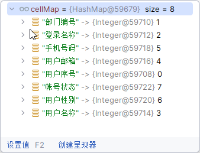

得到了

"部门编号" -> {Integer@59710} 1
"登录名称" -> {Integer@59712} 2
"手机号码" -> {Integer@59718} 5
"用户邮箱" -> {Integer@59716} 4
"用户序号" -> {Integer@59708} 0
"帐号状态" -> {Integer@59722} 7
"用户性别" -> {Integer@59720} 6
"用户名称" -> {Integer@59714} 3


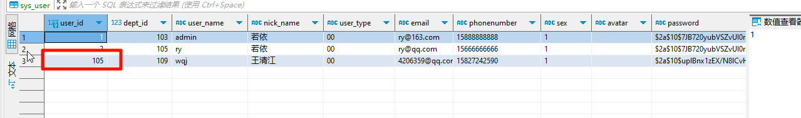

两个问题

1. user_id是自增的，没有必要让用户填！
2. 导入的时候竟然不可以导入角色信息，真是`气煞我也`。


列位可换

| 用户序号 | 部门编号 | 用户名称 | 登录名称 | 用户邮箱                                | 手机号码    | 用户性别 | 帐号状态 |
| -------- | -------- | -------- | -------- | --------------------------------------- | ----------- | -------- | -------- |
|          | 109      | 王清江1  | wqj2     | [4206359@qq.com](mailto:4206359@qq.com) | 15827242590 | 女       | 正常     |


角色可导

1. 写注解

```java
/**
 * 角色组
 */
@Excel(name = "角色组", type = Type.IMPORT)
private Long[] roleIds;
```

2. 写判断语句

```java
else if (Long[].class == fieldType){ // 为角色组量身定制的一个判断语句
    String newVal = (String)val;
    String[] arr = newVal.split(",");
    Long[] res = new Long[arr.length];
    for (int j = 0; j < arr.length; j++) {
        res[j] = Convert.toLong(arr[j]);
    }
    val = res;
}
```

3. 调用角色插入方法

```java
else
{
    failureNum++;
    failureMsg.append("<br/>" + failureNum + "、账号 " + user.getUserName() + " 已存在");
}
//无论是否存在，都更新角色信息，好不好？
insertUserRole(user);
```

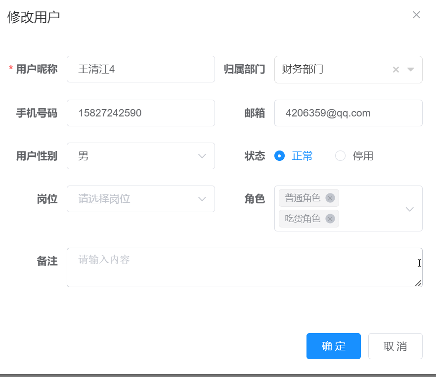


# 二十六、Excel导出

这里所说的导出是每一个界面都有一个按钮，叫导出。

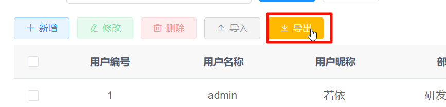


| 用户序号 | 登录名称 | 用户名称 | 用户邮箱       | 手机号码    | 用户性别 | 帐号状态 | 最后登录IP | 最后登录时间        | 部门名称 | 部门负责人 |
| -------- | -------- | -------- | -------------- | ----------- | -------- | -------- | ---------- | ------------------- | -------- | ---------- |
| 1        | admin    | 若依     | ry@163.com     | 15888888888 | 女       | 正常     | 127.0.0.1  | 2024-04-14 14:57:14 | 研发部门 | 若依       |
| 2        | ry       | 若依     | ry@qq.com      | 15666666666 | 女       | 正常     | 127.0.0.1  | 2024-04-14 14:57:14 | 测试部门 | 若依       |
| 105      | wqj      | 王清江   | 4206359@qq.com | 15827242590 | 女       | 正常     |            |                     | 财务部门 | 若依       |
| 106      | wqj2     | 王清江1  | 4206359@qq.com | 15827242590 | 女       | 正常     |            |                     | 财务部门 | 若依       |
| 107      | wqj3     | 王清江3  | 4206359@qq.com | 15827242590 | 男       | 正常     |            |                     | 财务部门 | 若依       |
| 108      | wqj4     | 王清江4  | 4206359@qq.com | 15827242590 | 男       | 正常     |            |                     | 财务部门 | 若依       |


官网的导入导出更加详细：

http://doc.ruoyi.vip/ruoyi-vue/document/htsc.html#%E5%AF%BC%E5%85%A5%E5%AF%BC%E5%87%BA


# 二十七、Demo实战


来玩一波大的，即兴创作。不写讲义。


# 二十八、XSS

在微服务`ruoyi-gateway`中，若依防止了XSS的攻击

```yml
  # 防止XSS攻击
  xss:
    enabled: true
    excludeUrls:
      - /system/notice
```


在浏览器看来，一切的<script></script>里面的代码都需要被执行，假设有下面的一个html：

```html

dasdasd165151dasd
dasdasdsad
asddsad


<script>
console.log(4206359)

</script>
```

谁能想到，这都能被执行。。


so，我们的用户的用户名等能在页面上渲染的字段，也有可能带有script代码，如此系统便存在危险。我们需要杜绝这种危险。

所以需要防止`XSS攻击`，若依已经做好了这件事，不必担心，我们debug看看他怎么做的就可以了。

该过滤器处于网关微服务中，每个请求都需要经过网关，正好过滤。

```java
package com.ruoyi.gateway.filter;


/**
 * 跨站脚本过滤器
 *
 * @author ruoyi
 */
@Component
@ConditionalOnProperty(value = "security.xss.enabled", havingValue = "true")
public class XssFilter implements GlobalFilter, Ordered
{
    // 跨站脚本的 xss 配置，nacos自行添加
    @Autowired
    private XssProperties xss;

    @Override
    public Mono<Void> filter(ServerWebExchange exchange, GatewayFilterChain chain)
    {
        ServerHttpRequest request = exchange.getRequest();
        // xss开关未开启 或 通过nacos关闭，不过滤
        if (!xss.getEnabled())
        {
            return chain.filter(exchange);
        }
        // GET DELETE 不过滤
        HttpMethod method = request.getMethod();
        if (method == null || method == HttpMethod.GET || method == HttpMethod.DELETE)
        {
            return chain.filter(exchange);
        }
        // 非json类型，不过滤
        if (!isJsonRequest(exchange))
        {
            return chain.filter(exchange);
        }
        // excludeUrls 不过滤
        String url = request.getURI().getPath();
        if (StringUtils.matches(url, xss.getExcludeUrls()))
        {
            return chain.filter(exchange);
        }
        ServerHttpRequestDecorator httpRequestDecorator = requestDecorator(exchange);
        return chain.filter(exchange.mutate().request(httpRequestDecorator).build());

    }

    private ServerHttpRequestDecorator requestDecorator(ServerWebExchange exchange)
    {
        ServerHttpRequestDecorator serverHttpRequestDecorator = new ServerHttpRequestDecorator(exchange.getRequest())
        {
            @Override
            public Flux<DataBuffer> getBody()
            {
                Flux<DataBuffer> body = super.getBody();
                return body.buffer().map(dataBuffers -> {
                    DataBufferFactory dataBufferFactory = new DefaultDataBufferFactory();
                    DataBuffer join = dataBufferFactory.join(dataBuffers);
                    byte[] content = new byte[join.readableByteCount()];
                    join.read(content);
                    DataBufferUtils.release(join);
                    String bodyStr = new String(content, StandardCharsets.UTF_8);
                    // 防xss攻击过滤
                    bodyStr = EscapeUtil.clean(bodyStr);
                    // 转成字节
                    byte[] bytes = bodyStr.getBytes(StandardCharsets.UTF_8);
                    NettyDataBufferFactory nettyDataBufferFactory = new NettyDataBufferFactory(ByteBufAllocator.DEFAULT);
                    DataBuffer buffer = nettyDataBufferFactory.allocateBuffer(bytes.length);
                    buffer.write(bytes);
                    return buffer;
                });
            }

            @Override
            public HttpHeaders getHeaders()
            {
                HttpHeaders httpHeaders = new HttpHeaders();
                httpHeaders.putAll(super.getHeaders());
                // 由于修改了请求体的body，导致content-length长度不确定，因此需要删除原先的content-length
                httpHeaders.remove(HttpHeaders.CONTENT_LENGTH);
                httpHeaders.set(HttpHeaders.TRANSFER_ENCODING, "chunked");
                return httpHeaders;
            }

        };
        return serverHttpRequestDecorator;
    }

    /**
     * 是否是Json请求
     * 
     * @param exchange HTTP请求
     */
    public boolean isJsonRequest(ServerWebExchange exchange)
    {
        String header = exchange.getRequest().getHeaders().getFirst(HttpHeaders.CONTENT_TYPE);
        return StringUtils.startsWithIgnoreCase(header, MediaType.APPLICATION_JSON_VALUE);
    }

    @Override
    public int getOrder()
    {
        return -100;
    }
}
```


以用户管理的修改用户`ry`为例子：


核心过滤代码：

```java
        @Override
        public Flux<DataBuffer> getBody()
        {
            Flux<DataBuffer> body = super.getBody();
            return body.buffer().map(dataBuffers -> {
                DataBufferFactory dataBufferFactory = new DefaultDataBufferFactory();
                DataBuffer join = dataBufferFactory.join(dataBuffers);
                byte[] content = new byte[join.readableByteCount()];
                join.read(content);
                DataBufferUtils.release(join);
                String bodyStr = new String(content, StandardCharsets.UTF_8);
                // 防xss攻击过滤
                bodyStr = EscapeUtil.clean(bodyStr);
                // 转成字节
                byte[] bytes = bodyStr.getBytes(StandardCharsets.UTF_8);
                NettyDataBufferFactory nettyDataBufferFactory = new NettyDataBufferFactory(ByteBufAllocator.DEFAULT);
                DataBuffer buffer = nettyDataBufferFactory.allocateBuffer(bytes.length);
                buffer.write(bytes);
                return buffer;
            });
        }
```


# 二十九、后端防止重复提交

在微服务`gateway`中，存在一个特殊的过滤器`CacheRequestFilter`，之前一直都略过，现在来看其作用。

经过一系列的研究，`CacheRequestFilter`没有找到他的作用，后端也没有防止重复提交的注解，所以我暂时认为它没有作用，如果大家后续发现有地方重复读取了body，请告诉我，我来临时录制。


之前我认为`CacheRequestFilter`是为了防止重复提交是因为Vue版本的是这样，没想到微服务没有相应的实现，它也许就是想告诉我们，让body可以重复读的话有相关的类直接调，不需要自己写。


# 三十、Swagger

讲述如何使用

启动微服务`rouyi-gen`。

1. 修改`bootstrap.yml`

```yml
# Tomcat
server:
  port: 9202

# Spring
spring: 
  application:
    # 应用名称
    name: ruoyi-gen
  profiles:
    # 环境配置
    active: dev
  cloud:
    nacos:
      discovery:
        # 服务注册地址
        server-addr: 154.211.15.157:8848
      config:
        # 配置中心地址
        server-addr: 154.211.15.157:8848
        # 配置文件格式
        file-extension: yml
        # 共享配置
        shared-configs:
          - application-${spring.profiles.active}.${spring.cloud.nacos.config.file-extension}
```

2. 修改nacos配置

```yml
# spring配置
spring:
  redis:
    host: 154.211.15.157
    port: 6379
    password: dfasf15asfasd56fas51
    database: 10
  datasource:
    driver-class-name: com.mysql.cj.jdbc.Driver
    url: jdbc:mysql://154.211.15.157:3306/ry-cloud1?useUnicode=true&characterEncoding=utf8&zeroDateTimeBehavior=convertToNull&useSSL=true&serverTimezone=GMT%2B8
    username: ry-cloud1
    password: 4x7N5x3msrjNNtwF

# mybatis配置
mybatis:
    # 搜索指定包别名
    typeAliasesPackage: com.ruoyi.gen.domain
    # 配置mapper的扫描，找到所有的mapper.xml映射文件
    mapperLocations: classpath:mapper/**/*.xml

# swagger配置
swagger:
  title: 代码生成接口文档
  license: Powered By ruoyi
  licenseUrl: https://ruoyi.vip

# 代码生成
gen:
  # 作者
  author: ruoyi
  # 默认生成包路径 system 需改成自己的模块名称 如 system monitor tool
  packageName: com.ruoyi.system
  # 自动去除表前缀，默认是false
  autoRemovePre: false
  # 表前缀（生成类名不会包含表前缀，多个用逗号分隔）
  tablePrefix: sys_

```

3. 启动微服务直接成功。


很舒服，啥都不用写，swagger接口就有了，爽。

接下来，如何添加token呢？


上述地方点一下，然后写上token即可。


聚合接口结果：

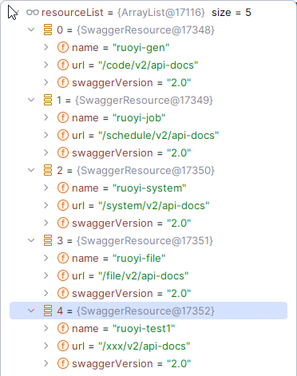


每一个微服务：

```java
@Bean
public Docket api(SwaggerProperties swaggerProperties)
{
    // base-path处理
    if (swaggerProperties.getBasePath().isEmpty())
    {
        swaggerProperties.getBasePath().add(BASE_PATH);
    }
    // noinspection unchecked
    List<Predicate<String>> basePath = new ArrayList<Predicate<String>>();
    swaggerProperties.getBasePath().forEach(path -> basePath.add(PathSelectors.ant(path)));

    // exclude-path处理
    if (swaggerProperties.getExcludePath().isEmpty())
    {
        swaggerProperties.getExcludePath().addAll(DEFAULT_EXCLUDE_PATH);
    }

    List<Predicate<String>> excludePath = new ArrayList<>();
    swaggerProperties.getExcludePath().forEach(path -> excludePath.add(PathSelectors.ant(path)));

    ApiSelectorBuilder builder = new Docket(DocumentationType.SWAGGER_2).host(swaggerProperties.getHost())
            .apiInfo(apiInfo(swaggerProperties)).select()
            .apis(RequestHandlerSelectors.basePackage(swaggerProperties.getBasePackage()));

    swaggerProperties.getBasePath().forEach(p -> builder.paths(PathSelectors.ant(p)));
    swaggerProperties.getExcludePath().forEach(p -> builder.paths(PathSelectors.ant(p).negate()));

    return builder.build().securitySchemes(securitySchemes()).securityContexts(securityContexts()).pathMapping("/");
}
```

这段代码是使用 Springfox Swagger（也称为 springfox-swagger 或者 springfox）生成 Swagger 文档的配置代码。让我来解释一下这段代码的各个部分：

1. `new Docket(DocumentationType.SWAGGER_2)`: 创建一个 Swagger Docket 对象，使用 Swagger 2.0 版本的规范。
2. `.host(swaggerProperties.getHost())`: 设置 Swagger 文档的主机地址，一般用于指定 API 文档的访问地址。
3. `.apiInfo(apiInfo(swaggerProperties))`: 使用 `apiInfo` 方法设置 API 文档的基本信息，包括标题、描述、版本号等。`apiInfo(swaggerProperties)` 方法是根据 `swaggerProperties` 对象中的信息创建 `ApiInfo` 对象。
4. `.select()`: 调用 `select` 方法开始配置哪些接口会被包含在 Swagger 文档中。
5. `.apis(RequestHandlerSelectors.basePackage(swaggerProperties.getBasePackage()))`: 使用 `basePackage` 方法指定需要包含在文档中的接口所在的基础包路径。这里使用了 `swaggerProperties.getBasePackage()` 方法获取配置文件中指定的基础包路径。

综合起来，这段代码的作用是创建一个 Swagger Docket 对象，并配置主机地址、API 文档基本信息，以及指定需要包含在文档中的接口所在的基础包路径。这样就可以根据这个配置生成对应的 Swagger API 文档了。


```java
private String basePackage = "com.ruoyi";
```


swagger自动扫描接口【无需手动注解】：

https://blog.csdn.net/Sky_for_me/article/details/107585852

https://blog.csdn.net/I_r_o_n_M_a_n/article/details/117609391

如果不想要某些微服务的接口被swagger接管【自行操作，不再赘述】：

https://blog.csdn.net/qq_19309473/article/details/131269343

# 三十一、生成代码

不做讲义，只讲单表。

```sql
CREATE TABLE `ry-cloud`.customer (
	id BIGINT auto_increment NOT NULL COMMENT '编号',
	username varchar(100) NULL COMMENT '用户名',
	nick_name varchar(100) NULL COMMENT '昵称',
	CONSTRAINT customer_pk PRIMARY KEY (id)
)
ENGINE=InnoDB
DEFAULT CHARSET=utf8mb4
COLLATE=utf8mb4_general_ci
COMMENT='顾客表';

```


树表、主子表在vue版已经讲过，没什么区别。

关闭微服务`gen`节省内存

# 三十二、文件上传和下载

启动微服务`ruoyi-file`

1. 修改bootstrap.yml

```yml
# Tomcat
server:
  port: 9300

# Spring
spring: 
  application:
    # 应用名称
    name: ruoyi-file
  profiles:
    # 环境配置
    active: dev
  cloud:
    nacos:
      discovery:
        # 服务注册地址
        server-addr: 154.211.15.157:8848
      config:
        # 配置中心地址
        server-addr: 154.211.15.157:8848
        # 配置文件格式
        file-extension: yml
        # 共享配置
        shared-configs:
          - application-${spring.profiles.active}.${spring.cloud.nacos.config.file-extension}
```

2. 修改配置中心

```yml
# 本地文件上传    
file:
    domain: http://127.0.0.1:9300
    path: D:/ruoyi/uploadPath
    prefix: /statics

# FastDFS配置
fdfs:
  domain: http://8.129.231.12
  soTimeout: 3000
  connectTimeout: 2000
  trackerList: 8.129.231.12:22122

# Minio配置
minio:
  url: http://8.129.231.12:9000
  accessKey: minioadmin
  secretKey: minioadmin
  bucketName: test
```

3. RuoYiFileApplication启动，直接成功

三种实现方式：

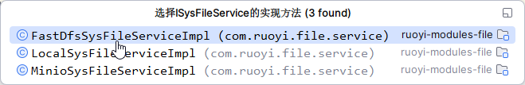

老话说，还得是挑选文件上传到本地来说


## 32.1 用代码生成来玩一下，例如客户中心：

1. 新建表：

```sql
-- `ry-cloud1`.customer definition

CREATE TABLE `ry-cloud`.customer (
	id BIGINT auto_increment NOT NULL,
	avatar VARCHAR(500) NULL,
	name varchar(100) NULL,
	pictures varchar(1000) NULL,
	files varchar(300) NULL,
	CONSTRAINT customer_pk PRIMARY KEY (id)
)
ENGINE=InnoDB
DEFAULT CHARSET=utf8mb4
COLLATE=utf8mb4_general_ci;


-- `ry-cloud`.customer definition

CREATE TABLE `customer` (
  `id` bigint(20) NOT NULL AUTO_INCREMENT,
  `avatar` varchar(500) DEFAULT NULL COMMENT '头像',
  `name` varchar(100) DEFAULT NULL COMMENT '姓名',
  `pictures` varchar(1000) DEFAULT NULL COMMENT '照片墙',
  `files` varchar(300) DEFAULT NULL COMMENT '文件',
  PRIMARY KEY (`id`)
) ENGINE=InnoDB DEFAULT CHARSET=utf8mb4;
```

2. 设置图片上传和文件上传

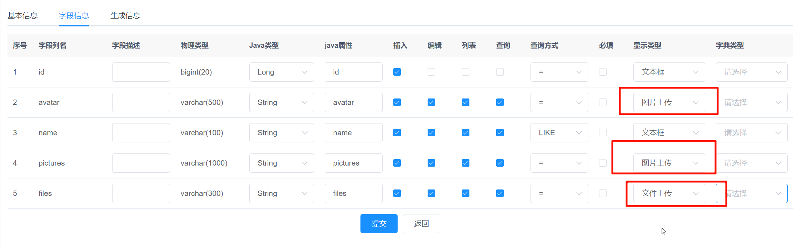

3. 微服务ruoyi-test1的yml添加mapper扫描路径

```yml
aa: 1234
# spring配置
spring:
  redis:
    host: 154.211.15.157
    port: 6379
    password: dfasf15asfasd56fas51
    database: 10
  datasource:
    druid:
      stat-view-servlet:
        enabled: true
        loginUsername: admin
        loginPassword: 123456
    dynamic:
      druid:
        initial-size: 5
        min-idle: 5
        maxActive: 20
        maxWait: 60000
        connectTimeout: 30000
        socketTimeout: 60000
        timeBetweenEvictionRunsMillis: 60000
        minEvictableIdleTimeMillis: 300000
        validationQuery: SELECT 1 FROM DUAL
        testWhileIdle: true
        testOnBorrow: false
        testOnReturn: false
        poolPreparedStatements: true
        maxPoolPreparedStatementPerConnectionSize: 20
        filters: stat,slf4j
        connectionProperties: druid.stat.mergeSql\=true;druid.stat.slowSqlMillis\=5000
      datasource:
          # 主库数据源
          master:
            driver-class-name: com.mysql.cj.jdbc.Driver
            url: jdbc:mysql://154.211.15.157:3306/ry-cloud1?useUnicode=true&characterEncoding=utf8&zeroDateTimeBehavior=convertToNull&useSSL=true&serverTimezone=GMT%2B8
            username: ry-cloud1
            password: 4x7N5x3msrjNNtwF
          # 从库数据源
          slave:
            username: ry-cloud10
            password: 2xXAEWDax6bzpECn
            url: jdbc:mysql://154.211.15.157:3306/ry-cloud10?useUnicode=true&characterEncoding=utf8&zeroDateTimeBehavior=convertToNull&useSSL=true&serverTimezone=GMT%2B8
            driver-class-name: com.mysql.cj.jdbc.Driver
# mybatis配置
mybatis:
    # 搜索指定包别名
    typeAliasesPackage: com.ruoyi.test1
    # 配置mapper的扫描，找到所有的mapper.xml映射文件
    mapperLocations: classpath:mapper/**/*.xml

# swagger配置
swagger:
  title: 系统模块接口文档
  license: Powered By ruoyi
  licenseUrl: https://ruoyi.vip
```

4. 启动类添加注解：

```java
@EnableCustomConfig   // 扫描mapper
@EnableCustomSwagger2   // swagger支持
```

5. 粘贴完毕所有的东西之后，启动`ruoyi-test1`微服务

注意`namespace`对不对：

```xml
<mapper namespace="com.ruoyi.test1.customer.mapper.CustomerMapper">

```

网关可能要改：

```yml
        # 新微服务
        - id: ruoyi-test1
          uri: lb://ruoyi-test1
          predicates:
            - Path=/test1/**
          filters:
            - StripPrefix=1
```

6. 查看页面：

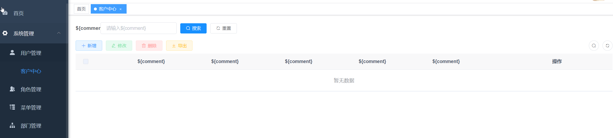

页面上的一堆dollar符号是因为我们没写comment，写上就好了。


## 32.2 debug上传

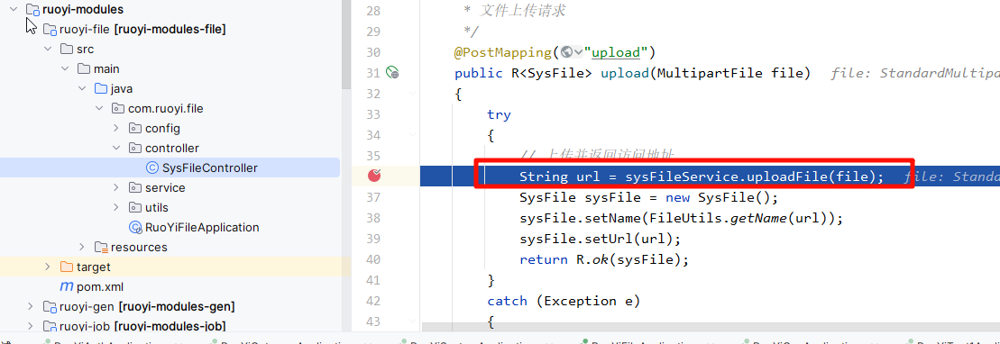


```html
<file-upload v-model="form.files" :file-type="['doc', 'xls', 'ppt', 'txt', 'pdf', 'zip']"/>
```


## 32.3 下载可用通用下载方法即可


http://doc.ruoyi.vip/ruoyi-cloud/cloud/file.html#%E5%9F%BA%E6%9C%AC%E4%BB%8B%E7%BB%8D


```js
['/dev-api/statics']: {
  target: `http://127.0.0.1:9300`,
  changeOrigin: true,
  pathRewrite: {
    ['^' + process.env.VUE_APP_BASE_API]: ''
  }
},
```


```js
// 通用下载方法
export function downloadGet(url, filename, config) {
  downloadLoadingInstance = Loading.service({
    text: "正在下载数据，请稍候",
    spinner: "el-icon-loading",
    background: "rgba(0, 0, 0, 0.7)",
  })
  return service.get(url, {
    headers: {'Content-Type': 'application/x-www-form-urlencoded'},
    responseType: 'blob',
    ...config
  }).then(async (data) => {
    const isBlob = blobValidate(data);
    if (isBlob) {
      const blob = new Blob([data])
      saveAs(blob, filename)
    } else {
      const resText = await data.text();
      const rspObj = JSON.parse(resText);
      const errMsg = errorCode[rspObj.code] || rspObj.msg || errorCode['default']
      Message.error(errMsg);
    }
    downloadLoadingInstance.close();
  }).catch((r) => {
    console.error(r)
    Message.error('下载文件出现错误，请联系管理员！')
    downloadLoadingInstance.close();
  })
}
```

# 三十三、总结

事务、分布式事务没讲。

前端讲得少，希望大家自带vue基础。


接下来想讲述移动端的课程，不知道各位有啥推荐


本课程课堂中书写的源代码：


